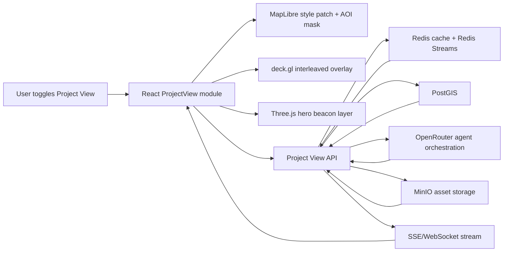
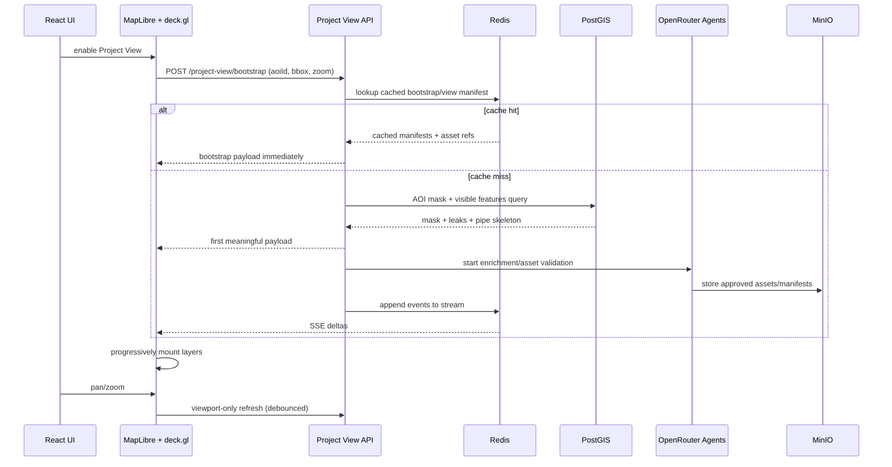

# Production Guide for a Backward-Compatible Project View Mode for Pipe and Leak Detection

## Executive Summary

The strongest production architecture is a hybrid one: keep the existing map stack intact, then add a feature-flagged “Project View” module that combines entity["software","MapLibre GL JS","web mapping library"] for style-layer control and AOI darkening, entity["software","deck.gl","GPU visualization framework"] for animated overlays and progressive rendering, and entity["software","Three.js","3D rendering library"] only for a small number of premium hologram beacons and hero effects. That recommendation is grounded in the official capabilities of MapLibre custom layers and style layers, deck.gl’s interleaved MapLibre integration, GPU masking/filtering extensions, animated path support, and Three.js custom-layer embedding against the shared map canvas. citeturn16view1turn16view0turn19view0turn31view1turn23view0turn26view2

For your use case, backward compatibility is not a nice-to-have. It should be the primary design constraint. The new mode should be isolated behind a feature flag, should add only namespaced sources/layers such as `pv:*`, should patch style properties at runtime with a reversible restore stack, and should never mutate the legacy layer manager or base map config permanently. When the flag is off, the app should behave exactly as it does today. When the flag is on, the module should mount AOI masking, building extrusions, animated pipes, leak pulses, callouts, and beacons as an overlay package that can be torn down cleanly. This is consistent with how MapLibre layers can be added/filtered at runtime and how deck.gl overlays can be mounted and updated incrementally. citeturn20view2turn20view3turn20view5turn19view0

On the backend, use entity["software","PostGIS","PostgreSQL spatial extension"] for AOI geometry, clipping, masking, and optional vector-tile generation; urlRedisturn16view6 for cache-first bootstrap, job/event streams, and view-result reuse; and urlMinIOturn22search3 for private S3-compatible asset storage and presigned delivery. For agent orchestration and Claude Code workflows, route through urlOpenRouterturn21view2 using structured outputs, tool calling, the server-side web search tool, and response caching, but keep agents manifest-only and sandboxed so they can propose assets, manifests, adapters, and tests without directly mutating production. citeturn17view0turn17view1turn17view4turn16view13turn16view6turn28search2turn28search0turn16view9turn27view1turn16view10turn16view11

A critical implementation choice is to stay on WebGL2 for now. deck.gl’s MapLibre interleaving requires WebGL2 and `maplibre-gl` greater than 3, while deck.gl’s WebGPU support is still explicitly marked as not production ready. For a production-grade mode that must not destabilize the existing app, WebGL2 is the right call. citeturn16view0turn4search19

Auth, tenancy, and the existing state-management approach are unspecified in your request. The guide below assumes those concerns already exist in your application and that the new module will plug into them rather than replace them.

### Open Questions and Limitations

The largest unknowns are your current style source names, existing source-of-truth schemas for pipes/buildings/leaks, your current auth/tenant guard model, and whether your existing app already uses a server tile pipeline or loads GeoJSON directly. Those details do not change the recommended architecture, but they do affect the exact file paths, DTO shapes, and migration strategy.

## Recommended Architecture

The target architecture is a **self-contained Project View package** that activates only when the feature flag is enabled. The package should do four things in sequence: patch the map style, request a cache-first bootstrap payload for the current AOI and viewport, progressively stream richer overlays, and optionally mount a very small number of premium Three.js beacon scenes. This split aligns cleanly with the official boundaries of MapLibre style layers, deck.gl overlay layers, MapLibre custom layers, Redis Streams, PostGIS clipping functions, and OpenRouter tool/structured-output workflows. citeturn16view1turn16view0turn31view1turn16view6turn17view1turn25search0turn27view1turn16view9



The render flow should be **cache-first and viewport-constrained**. Use `map.getBounds()`, `map.getZoom()`, and `map.getCenter()` to derive the request envelope; bootstrap only the current viewport; return the AOI mask and highest-priority overlays first; then stream layer deltas over SSE by default and optionally use WebSockets for bidirectional control or diagnostics. MapLibre exposes map bounds/zoom/center directly, NestJS has first-class SSE and WebSocket gateway support, and Redis Streams are built for append-only event recording with consumer-group delivery patterns. citeturn29view0turn29view2turn29view3turn16view7turn16view8turn16view6



### Implementation Options

| Option | Strength | Weakness | Verdict |
|---|---|---|---|
| MapLibre-only | Excellent for AOI darkening, line/fill style control, runtime filters, and simple building extrusions through `fill-extrusion`. citeturn20view3turn20view0turn20view2 | Weak for complex GPU animation, reusable masking across many dynamic overlay types, and premium 3D beacon effects. | Good for baseline AOI mode, not enough for the full premium experience. |
| deck.gl-heavy | Strong for GPU masking, data filtering, animated trips, binary path data, text, scenegraphs, and interleaving with the map stack. citeturn31view1turn19view5turn23view0turn19view2turn19view3turn19view6turn19view0 | It cannot directly restyle the basemap outside the AOI, so AOI darkening still needs MapLibre style layers or a custom base-layer strategy. | Best overlay engine, but not the whole solution. |
| Three.js-heavy | Best for cinematic hero objects, hologram beams, additive-glow billboards, custom blending, and premium motion language through map-embedded custom layers. citeturn16view1turn26view2turn18view3 | Higher engineering cost, more scene-management risk, and not ideal for large numbers of repeated asset instances. | Use sparingly for hero beacons only. |
| Hybrid | Uses each engine where it is strongest: MapLibre for AOI darkening/style patch, deck.gl for the bulk of overlay rendering, Three.js for premium beacon/callout hero moments. citeturn16view0turn16view1turn31view1turn19view6turn26view2 | Slightly more integration work up front. | Recommended. |

## Data and Persistence Design

The core persistence model should separate **geospatial truth**, **render caches**, **assets**, and **graph memory**. PostGIS holds parcels, pipes, buildings, leaks, and AOI derivations. Redis holds cache-first bootstrap/view manifests and job/event streams. MinIO stores icon atlases, SVG/Lottie packages, GLB/KTX2 assets, thumbnails, and manifests. Graph memory stores reusable concept-to-asset lineage so the system does not regenerate the same visual assets for related future queries. PostGIS functions such as `ST_Intersects`, `ST_Intersection`, `ST_Difference`, `ST_Subdivide`, `ST_AsGeoJSON`, `ST_TileEnvelope`, `ST_AsMVTGeom`, and `ST_AsMVT` are exactly the right primitives for this. citeturn17view4turn17view1turn25search0turn17view3turn16view12turn30search0turn30search5turn16view13turn17view5

### PostGIS Schema and Migration SQL

```sql
CREATE EXTENSION IF NOT EXISTS postgis;

CREATE TABLE IF NOT EXISTS project_parcel_aoi (
  id uuid PRIMARY KEY,
  project_id uuid NOT NULL,
  parcel_code text,
  name text,
  geom geometry(MultiPolygon, 4326) NOT NULL,
  geom_3857 geometry(MultiPolygon, 3857),
  boundary geometry(MultiLineString, 4326),
  centroid geometry(Point, 4326),
  version bigint NOT NULL DEFAULT 1,
  metadata jsonb NOT NULL DEFAULT '{}'::jsonb,
  updated_at timestamptz NOT NULL DEFAULT now(),
  CHECK (ST_IsValid(geom))
);

CREATE INDEX IF NOT EXISTS idx_project_parcel_aoi_project_id
  ON project_parcel_aoi(project_id);

CREATE INDEX IF NOT EXISTS idx_project_parcel_aoi_geom_gist
  ON project_parcel_aoi
  USING GIST (geom);

CREATE INDEX IF NOT EXISTS idx_project_parcel_aoi_geom_3857_gist
  ON project_parcel_aoi
  USING GIST (geom_3857);

CREATE TABLE IF NOT EXISTS pipe_segment (
  id uuid PRIMARY KEY,
  project_id uuid NOT NULL,
  aoi_id uuid REFERENCES project_parcel_aoi(id) ON DELETE SET NULL,
  asset_id text,
  status text NOT NULL DEFAULT 'active',
  material text,
  diameter_mm integer,
  pressure_zone text,
  risk_score numeric(10,4) NOT NULL DEFAULT 0,
  concern boolean NOT NULL DEFAULT false,
  geom geometry(MultiLineString, 4326) NOT NULL,
  updated_at timestamptz NOT NULL DEFAULT now(),
  properties jsonb NOT NULL DEFAULT '{}'::jsonb
);

CREATE INDEX IF NOT EXISTS idx_pipe_segment_project_id
  ON pipe_segment(project_id);

CREATE INDEX IF NOT EXISTS idx_pipe_segment_aoi_id
  ON pipe_segment(aoi_id);

CREATE INDEX IF NOT EXISTS idx_pipe_segment_geom_gist
  ON pipe_segment
  USING GIST (geom);

CREATE TABLE IF NOT EXISTS building_footprint (
  id uuid PRIMARY KEY,
  project_id uuid NOT NULL,
  aoi_id uuid REFERENCES project_parcel_aoi(id) ON DELETE SET NULL,
  name text,
  height_m numeric(10,2),
  kind text,
  concern boolean NOT NULL DEFAULT false,
  geom geometry(MultiPolygon, 4326) NOT NULL,
  updated_at timestamptz NOT NULL DEFAULT now(),
  properties jsonb NOT NULL DEFAULT '{}'::jsonb
);

CREATE INDEX IF NOT EXISTS idx_building_footprint_geom_gist
  ON building_footprint
  USING GIST (geom);

CREATE TABLE IF NOT EXISTS leak_event (
  id uuid PRIMARY KEY,
  project_id uuid NOT NULL,
  aoi_id uuid REFERENCES project_parcel_aoi(id) ON DELETE SET NULL,
  severity smallint NOT NULL,
  status text NOT NULL,
  detected_at timestamptz NOT NULL,
  geom geometry(Point, 4326) NOT NULL,
  properties jsonb NOT NULL DEFAULT '{}'::jsonb
);

CREATE INDEX IF NOT EXISTS idx_leak_event_detected_at
  ON leak_event(detected_at DESC);

CREATE INDEX IF NOT EXISTS idx_leak_event_geom_gist
  ON leak_event
  USING GIST (geom);

CREATE TABLE IF NOT EXISTS project_view_asset (
  id uuid PRIMARY KEY,
  tenant_id uuid,
  kind text NOT NULL,                 -- svg, lottie, glb, ktx2, atlas, manifesto
  logical_name text NOT NULL,
  mime_type text NOT NULL,
  bucket text NOT NULL,
  object_key text NOT NULL,
  sha256 text NOT NULL UNIQUE,
  width_px integer,
  height_px integer,
  bytes bigint NOT NULL,
  codec text,
  tags text[] NOT NULL DEFAULT '{}',
  metadata jsonb NOT NULL DEFAULT '{}'::jsonb,
  created_by text NOT NULL,
  created_at timestamptz NOT NULL DEFAULT now()
);

CREATE INDEX IF NOT EXISTS idx_project_view_asset_logical_name
  ON project_view_asset(logical_name);

CREATE TABLE IF NOT EXISTS project_view_graph_node (
  id uuid PRIMARY KEY,
  tenant_id uuid,
  kind text NOT NULL,                 -- concept, query, asset, site, anomaly, vendor, product
  label text NOT NULL,
  geom geometry(Geometry, 4326),
  asset_id uuid REFERENCES project_view_asset(id) ON DELETE SET NULL,
  attributes jsonb NOT NULL DEFAULT '{}'::jsonb,
  created_at timestamptz NOT NULL DEFAULT now()
);

CREATE INDEX IF NOT EXISTS idx_project_view_graph_node_kind
  ON project_view_graph_node(kind);

CREATE INDEX IF NOT EXISTS idx_project_view_graph_node_geom_gist
  ON project_view_graph_node
  USING GIST (geom);

CREATE TABLE IF NOT EXISTS project_view_graph_edge (
  id uuid PRIMARY KEY,
  tenant_id uuid,
  src_node_id uuid NOT NULL REFERENCES project_view_graph_node(id) ON DELETE CASCADE,
  dst_node_id uuid NOT NULL REFERENCES project_view_graph_node(id) ON DELETE CASCADE,
  relation text NOT NULL,             -- visualized_by, near, similar_to, sourced_from, cached_as
  weight numeric(10,4) NOT NULL DEFAULT 1,
  attributes jsonb NOT NULL DEFAULT '{}'::jsonb,
  created_at timestamptz NOT NULL DEFAULT now()
);

CREATE INDEX IF NOT EXISTS idx_project_view_graph_edge_src
  ON project_view_graph_edge(src_node_id);

CREATE INDEX IF NOT EXISTS idx_project_view_graph_edge_dst
  ON project_view_graph_edge(dst_node_id);

CREATE MATERIALIZED VIEW IF NOT EXISTS project_parcel_aoi_subdivided AS
SELECT
  id AS aoi_id,
  (ST_Dump(ST_Subdivide(ST_Transform(geom, 3857), 256))).geom AS geom_3857
FROM project_parcel_aoi;

CREATE INDEX IF NOT EXISTS idx_project_parcel_aoi_subdivided_geom_gist
  ON project_parcel_aoi_subdivided
  USING GIST (geom_3857);
```

This schema uses GiST spatial indexes for geometry lookups, and it deliberately keeps the AOI subdivision materialized because PostGIS explicitly notes that `ST_Subdivide` usually improves indexed point-in-polygon and related spatial operations by making bounding boxes smaller and reducing recheck complexity. `ST_Intersects` is spatial-index aware, and GiST is the correct access method for these geometry columns. citeturn17view3turn17view4turn17view5turn17view6

### Parcel Masking SQL

Use a **viewport-local inverse mask**, not a world-scale inverse polygon, for Project View. It is lighter to serialize, faster to repaint, and aligns with the requirement that queries remain viewport-only.

```sql
WITH viewport AS (
  SELECT ST_MakeEnvelope($1, $2, $3, $4, 4326) AS geom
),
aoi AS (
  SELECT ST_MakeValid(geom) AS geom
  FROM project_parcel_aoi
  WHERE id = $5
),
clipped_aoi AS (
  SELECT ST_Intersection(aoi.geom, viewport.geom) AS geom
  FROM aoi, viewport
)
SELECT jsonb_build_object(
  'type', 'Feature',
  'id', $5,
  'properties', jsonb_build_object('kind', 'aoi-mask'),
  'geometry', ST_AsGeoJSON(
    ST_Difference(
      (SELECT geom FROM viewport),
      COALESCE((SELECT geom FROM clipped_aoi), 'POLYGON EMPTY'::geometry)
    ),
    6
  )::jsonb
) AS feature;
```

`ST_MakeEnvelope` gives you the viewport polygon, `ST_Intersection` clips the AOI to the visible region, `ST_Difference` computes the inverse mask, and `ST_AsGeoJSON` serializes the result for MapLibre. Those functions are all official PostGIS primitives designed for exactly this sort of clipping and formatting workflow. citeturn17view0turn17view1turn25search0turn16view12

### Optional MVT Endpoint for Large Datasets

If your current app already performs well with visible GeoJSON overlays, keep the prototype simple and start there. For larger sites or denser plants, move pipes and buildings to vector tiles.

```sql
WITH bounds AS (
  SELECT ST_TileEnvelope($1, $2, $3) AS tile_3857
),
visible AS (
  SELECT
    p.id,
    p.status,
    p.risk_score,
    ST_AsMVTGeom(
      ST_Transform(
        ST_Intersection(
          p.geom,
          ST_Transform(bounds.tile_3857, 4326)
        ),
        3857
      ),
      bounds.tile_3857
    ) AS geom
  FROM pipe_segment p, bounds
  WHERE p.project_id = $4
    AND ST_Intersects(p.geom, ST_Transform(bounds.tile_3857, 4326))
)
SELECT ST_AsMVT(visible, 'pipes', 4096, 'geom', 'id')
FROM visible;
```

PostGIS documents `ST_TileEnvelope` for XYZ tile bounds, `ST_AsMVTGeom` for transforming/clipping geometry into tile coordinate space, and `ST_AsMVT` for emitting binary vector tiles. citeturn30search0turn30search5turn16view13

### Redis Keys

| Key | Purpose | TTL |
|---|---|---|
| `pv:aoi:{tenant}:{aoiId}:v{version}` | AOI mask, boundary, centroid, style patch payload | 24h |
| `pv:view:{tenant}:{aoiId}:{bboxHash}:{zBucket}:{layerHash}:{dataVersion}` | Viewport bootstrap payload | 5m |
| `pv:job:{jobId}:state` | Bootstrap/job state blob | 1h |
| `pv:job:{jobId}:events` | Redis Stream of deltas | 1h |
| `pv:asset:{sha256}` | Asset metadata lookup | 30d |
| `pv:manifest:{manifestId}` | Layer manifest JSON | 24h |
| `pv:graph:node:{nodeId}` | Fast graph node lookup cache | 30d |

Use Redis Streams, not bare Pub/Sub, for render events. Streams are append-only logs with random access and consumer-group support, which is a materially better fit for reconnectable SSE consumers and worker fan-out than ephemeral Pub/Sub. citeturn16view6

### MinIO Buckets

| Bucket | Contents | Policy |
|---|---|---|
| `pv-assets` | Approved SVG, Lottie, GLB, KTX2, icon atlases, manifests | Private, presigned GET |
| `pv-staging` | Agent-generated assets pending validation | Private, no public reads |
| `pv-thumbnails` | PNG/WebP previews for quick UI cards | Private or CDN-fronted private |
| `pv-audit` | Agent transcripts, validation reports, screenshots, traces | Private, retention-controlled |

MinIO’s current documentation describes an S3-compatible object API and JavaScript SDK, and the JS API documents presigned GET/PUT support for private-bucket delivery. That makes it a clean fit for asset serving and promotion workflows. citeturn22search3turn22search6turn28search2turn28search0

### Example Graph Memory Entries

```json
[
  {
    "id": "node-concept-pressure-anomaly-zone-a",
    "kind": "concept",
    "label": "Pressure anomaly in Zone A",
    "attributes": {
      "summary": "Drop in pressure correlated with two unresolved leak investigations",
      "severity": "high",
      "queryHashes": ["q:c4f3d...", "q:de781..."],
      "preferredCalloutAssetId": "asset-callout-red-01"
    }
  },
  {
    "id": "node-asset-callout-red-01",
    "kind": "asset",
    "label": "High-severity leak callout badge",
    "attributes": {
      "manifestId": "assetmf_01JX...",
      "styleFamily": "hologram-red",
      "reusableFor": ["leak", "pressure-drop", "critical-asset"]
    }
  },
  {
    "id": "edge-1",
    "src_node_id": "node-concept-pressure-anomaly-zone-a",
    "dst_node_id": "node-asset-callout-red-01",
    "relation": "visualized_by",
    "weight": 0.98
  }
]
```

## Client Implementation

The client should be introduced as a **new mode package**, not as a rewrite of your existing map stack. The Project View module should mount only when the feature flag is enabled, add only `pv:*` sources/layers, and fully restore the prior state on exit. That is the safest backward-compatible pattern.

### File and Folder Patch Plan

```text
src/
  features/
    project-view/
      ProjectViewMode.tsx
      ProjectViewToggle.tsx
      projectView.types.ts
      state/
        projectViewStore.ts
        projectViewFeatureFlag.ts
      api/
        projectViewClient.ts
        projectViewEvents.ts
      style/
        applyProjectViewStylePatch.ts
        removeProjectViewStylePatch.ts
        projectViewStyleTokens.ts
      map/
        mountProjectViewSources.ts
        removeProjectViewArtifacts.ts
        getMapLabelAnchor.ts
        viewportHash.ts
      layers/
        buildProjectViewLayers.ts
        PipeTripsLayerFactory.ts
        LeakPulseLayerFactory.ts
        BuildingExtrusionLayerFactory.ts
        CalloutTextLayerFactory.ts
        ScenegraphBeaconLayerFactory.ts
        experimental/
          FlowBandPathLayer.ts
      three/
        createHologramBeaconLayer.ts
      assets/
        assetResolver.ts
        assetFallbacks.ts
      hooks/
        useProjectViewMode.ts
        useProjectViewViewportSync.ts
        useProjectViewSSE.ts
      __tests__/
        applyProjectViewStylePatch.test.ts
        viewportHash.test.ts
        buildProjectViewLayers.test.ts
  tests/
    e2e/
      project-view.spec.ts
```

The patch plan is intentionally additive. Nothing needs to be removed from your existing application.

### Feature Flag and Mode Mount

```tsx
// src/features/project-view/hooks/useProjectViewMode.ts
import {useCallback, useRef} from 'react';
import maplibregl from 'maplibre-gl';
import {MapboxOverlay} from '@deck.gl/mapbox';
import {applyProjectViewStylePatch} from '../style/applyProjectViewStylePatch';
import {mountProjectViewSources, removeProjectViewArtifacts} from '../map/mountProjectViewSources';
import {buildProjectViewLayers} from '../layers/buildProjectViewLayers';
import {projectViewClient} from '../api/projectViewClient';

type EnableProjectViewArgs = {
  aoiId: string;
  map: maplibregl.Map;
  overlay: MapboxOverlay;
};

export function useProjectViewMode() {
  const teardownRef = useRef<() => void>(() => undefined);

  const disable = useCallback(() => {
    teardownRef.current?.();
    teardownRef.current = () => undefined;
  }, []);

  const enable = useCallback(async ({aoiId, map, overlay}: EnableProjectViewArgs) => {
    disable();

    const bounds = map.getBounds();
    const bbox: [number, number, number, number] = [
      bounds.getWest(),
      bounds.getSouth(),
      bounds.getEast(),
      bounds.getNorth()
    ];

    const bootstrap = await projectViewClient.bootstrap({
      aoiId,
      bbox,
      zoom: map.getZoom(),
      center: [map.getCenter().lng, map.getCenter().lat]
    });

    const restoreStyle = applyProjectViewStylePatch(map, bootstrap.stylePatch);
    mountProjectViewSources(map, bootstrap.aoiMask, bootstrap.aoiBoundary);

    overlay.setProps({
      layers: buildProjectViewLayers(bootstrap)
    });

    const eventSource = projectViewClient.openSse(bootstrap.jobId, (evt) => {
      overlay.setProps({
        layers: buildProjectViewLayers(evt.nextState)
      });
    });

    teardownRef.current = () => {
      eventSource.close();
      overlay.setProps({layers: []});
      removeProjectViewArtifacts(map);
      restoreStyle();
    };
  }, [disable]);

  return {enable, disable};
}
```

Use MapLibre’s `getBounds`, `getZoom`, and `getCenter` directly for viewport-local requests. That keeps every query constrained to what the user can actually see and supports cache reuse at the view-manifest level. citeturn29view0turn29view2turn29view3

### MapLibre Style Patch and AOI Darkening

The cleanest visual pattern is:

1. Hide non-essential base labels globally in this mode.
2. Add a viewport-local inverse AOI mask as a MapLibre `fill` layer.
3. Add AOI boundary glow as one or two `line` layers.
4. Optionally add site buildings as MapLibre `fill-extrusion` if your current data flow already feeds those geometries to the map.

```ts
// src/features/project-view/style/applyProjectViewStylePatch.ts
import maplibregl from 'maplibre-gl';

type StylePatch = {
  hideLayerIds: string[];
  dimLayerIds: string[];
  labelAnchorId: string;
};

type UndoEntry =
  | {kind: 'layout'; layerId: string; name: string; value: unknown}
  | {kind: 'paint'; layerId: string; name: string; value: unknown};

export function applyProjectViewStylePatch(map: maplibregl.Map, patch: StylePatch) {
  const undo: UndoEntry[] = [];

  for (const layerId of patch.hideLayerIds) {
    if (!map.getLayer(layerId)) continue;
    undo.push({
      kind: 'layout',
      layerId,
      name: 'visibility',
      value: map.getLayoutProperty(layerId, 'visibility')
    });
    map.setLayoutProperty(layerId, 'visibility', 'none');
  }

  for (const layerId of patch.dimLayerIds) {
    if (!map.getLayer(layerId)) continue;

    const likelyOpacityProps = [
      'line-opacity',
      'fill-opacity',
      'fill-extrusion-opacity',
      'circle-opacity',
      'text-opacity',
      'icon-opacity',
      'raster-opacity'
    ] as const;

    for (const prop of likelyOpacityProps) {
      const prev = map.getPaintProperty(layerId, prop);
      if (prev !== undefined) {
        undo.push({kind: 'paint', layerId, name: prop, value: prev});
        map.setPaintProperty(layerId, prop, 0.12);
      }
    }
  }

  return () => {
    for (const entry of undo.reverse()) {
      if (entry.kind === 'layout' && map.getLayer(entry.layerId)) {
        map.setLayoutProperty(entry.layerId, entry.name, entry.value as any);
      }
      if (entry.kind === 'paint' && map.getLayer(entry.layerId)) {
        map.setPaintProperty(entry.layerId, entry.name, entry.value as any);
      }
    }
  };
}
```

```ts
// src/features/project-view/map/mountProjectViewSources.ts
import maplibregl from 'maplibre-gl';

export function mountProjectViewSources(
  map: maplibregl.Map,
  aoiMask: GeoJSON.Feature,
  aoiBoundary: GeoJSON.Feature
) {
  if (!map.getSource('pv:aoi-mask')) {
    map.addSource('pv:aoi-mask', {type: 'geojson', data: aoiMask});
    map.addLayer({
      id: 'pv:aoi-mask-fill',
      type: 'fill',
      source: 'pv:aoi-mask',
      paint: {
        'fill-color': '#020611',
        'fill-opacity': [
          'interpolate',
          ['linear'],
          ['zoom'],
          13, 0.72,
          17, 0.84,
          20, 0.90
        ]
      }
    });
  }

  if (!map.getSource('pv:aoi-boundary')) {
    map.addSource('pv:aoi-boundary', {type: 'geojson', data: aoiBoundary});

    map.addLayer({
      id: 'pv:aoi-boundary-glow',
      type: 'line',
      source: 'pv:aoi-boundary',
      paint: {
        'line-color': '#62ecff',
        'line-width': ['interpolate', ['linear'], ['zoom'], 13, 2, 19, 8],
        'line-opacity': 0.85,
        'line-blur': 1.25
      }
    });

    map.addLayer({
      id: 'pv:aoi-boundary-core',
      type: 'line',
      source: 'pv:aoi-boundary',
      paint: {
        'line-color': '#ecfcff',
        'line-width': ['interpolate', ['linear'], ['zoom'], 13, 1, 19, 2],
        'line-opacity': 1
      }
    });
  }
}
```

MapLibre style layers support `fill`, `line`, and `fill-extrusion`, and runtime filtering/visibility changes are first-class features. That makes this AOI-darkening pattern low risk and fully reversible. citeturn20view3turn20view1turn20view0turn20view2

### deck.gl Layer Package

The bulk of the visual system should live in deck.gl, mounted with `MapboxOverlay({ interleaved: true })` so deck.gl and MapLibre share the same WebGL2 context and correct 3D ordering. Use a hidden mask layer plus `MaskExtension` so all premium overlays stay clipped to the AOI on the GPU. Put masked layers in the same `beforeId` group so extension behavior remains correct. citeturn16view0turn19view0turn31view1

```ts
// src/features/project-view/layers/buildProjectViewLayers.ts
import {GeoJsonLayer, ScatterplotLayer, TextLayer, PathLayer} from '@deck.gl/layers';
import {TripsLayer} from '@deck.gl/geo-layers';
import {ScenegraphLayer} from '@deck.gl/mesh-layers';
import {MaskExtension} from '@deck.gl/extensions';

const AOI_MASK_ID = 'pv:mask';
const BEFORE_ID = 'road-label'; // replace with your actual first label anchor

export function buildProjectViewLayers(state: any) {
  return [
    new GeoJsonLayer({
      id: AOI_MASK_ID,
      data: state.aoiBoundaryFeature,
      operation: 'mask',
      beforeId: BEFORE_ID
    }),

    new GeoJsonLayer({
      id: 'pv:buildings',
      data: state.buildings,
      extruded: true,
      filled: true,
      stroked: false,
      pickable: true,
      getElevation: (f: any) => f.properties.height_m ?? 8,
      getFillColor: (f: any) => f.properties.concern ? [30, 170, 255, 220] : [10, 45, 92, 180],
      extensions: [new MaskExtension()],
      maskId: AOI_MASK_ID,
      beforeId: BEFORE_ID
    }),

    new PathLayer({
      id: 'pv:pipes-base',
      data: state.pipesBinary,
      _pathType: 'open',
      widthUnits: 'meters',
      widthMinPixels: 2,
      getPath: (d: any) => d.path,
      getColor: (d: any) => d.alert ? [255, 94, 94, 230] : [90, 255, 235, 210],
      getWidth: (d: any) => Math.max((d.diameter_mm ?? 50) / 100, 0.5),
      extensions: [new MaskExtension()],
      maskId: AOI_MASK_ID,
      beforeId: BEFORE_ID
    }),

    new TripsLayer({
      id: 'pv:pipes-flow',
      data: state.flowTrips,
      getPath: (d: any) => d.path,
      getTimestamps: (d: any) => d.timestamps,
      getColor: (d: any) => d.alert ? [255, 180, 80] : [130, 255, 245],
      currentTime: state.animationTime,
      trailLength: 120,
      fadeTrail: true,
      widthMinPixels: 3,
      jointRounded: true,
      capRounded: true,
      extensions: [new MaskExtension()],
      maskId: AOI_MASK_ID,
      beforeId: BEFORE_ID
    }),

    new ScatterplotLayer({
      id: 'pv:leak-pulses',
      data: state.leaks,
      getPosition: (d: any) => d.coordinates,
      getRadius: (d: any) => d.pulseRadiusM,
      radiusUnits: 'meters',
      stroked: true,
      filled: true,
      lineWidthMinPixels: 2,
      getLineColor: [255, 210, 210, 255],
      getFillColor: (d: any) => d.severity >= 4 ? [255, 90, 90, 110] : [255, 184, 77, 90],
      extensions: [new MaskExtension()],
      maskId: AOI_MASK_ID,
      beforeId: BEFORE_ID
    }),

    new TextLayer({
      id: 'pv:callouts',
      data: state.callouts,
      getPosition: (d: any) => d.coordinates,
      getText: (d: any) => d.text,
      getSize: (d: any) => d.size ?? 16,
      getColor: (d: any) => d.color ?? [220, 248, 255, 255],
      getTextAnchor: 'start',
      getAlignmentBaseline: 'center',
      pickable: false,
      extensions: [new MaskExtension()],
      maskId: AOI_MASK_ID,
      beforeId: BEFORE_ID
    }),

    new ScenegraphLayer({
      id: 'pv:beacons-instanced',
      data: state.beacons,
      scenegraph: state.beaconGlbUrl,
      getPosition: (d: any) => d.coordinates,
      getOrientation: () => [0, 0, 0],
      sizeScale: 5,
      _animations: {'*': {speed: 1.4}},
      _lighting: 'pbr',
      pickable: true,
      extensions: [new MaskExtension()],
      maskId: AOI_MASK_ID,
      beforeId: BEFORE_ID
    })
  ];
}
```

The production logic above is based on deck.gl’s documented interleaving model, mask layers with `operation: 'mask'`, GPU filtering/masking, `TripsLayer` animated paths, `ScenegraphLayer` instanced glTF rendering, and `TextLayer` for high-volume labels. `TripsLayer` timestamps are stored as float32, so normalize time to a relative scale instead of raw Unix epoch values. For large path datasets, prefer binary path buffers and `startIndices` to avoid per-frame CPU normalization overhead. citeturn19view0turn31view1turn23view0turn19view6turn19view3turn19view2

### Optional Shader Upgrade for Premium Pipe Flow

Ship the production MVP with `TripsLayer`. It is stable and fast. If you want a sleeker “energy stream inside the pipe” effect later, add a subclassed `PathLayer` in a sandbox branch and use deck.gl shader hooks for phase-shifted emissive bands.

```ts
// src/features/project-view/layers/experimental/FlowBandPathLayer.ts
import {PathLayer} from '@deck.gl/layers';

export class FlowBandPathLayer<DataT = any> extends PathLayer<DataT> {
  getShaders() {
    const shaders = super.getShaders();
    return {
      ...shaders,
      inject: {
        'vs:#decl': `
          uniform float pvTime;
        `,
        'fs:#decl': `
          uniform vec3 pvGlowColor;
        `,
        'fs:DECKGL_FILTER_COLOR': `
          float wave = abs(fract(geometry.uv.x * 8.0 - pvTime * 2.2) - 0.5);
          float band = 1.0 - smoothstep(0.12, 0.28, wave);
          color.rgb = mix(color.rgb, pvGlowColor, band * 0.85);
          color.a *= 0.70 + band * 0.30;
        `
      }
    };
  }

  draw({uniforms}: any) {
    super.draw({
      uniforms: {
        ...uniforms,
        pvTime: this.props.time ?? 0,
        pvGlowColor: this.props.glowColor ?? [0.40, 0.96, 1.0]
      }
    });
  }
}
```

Use this only after sandbox validation. deck.gl’s shader-injection hooks are officially supported, but the project also notes that custom-layer shader plumbing in newer versions is moving toward uniform-buffer-oriented patterns, so treat this as a controlled enhancement rather than the day-one dependency. citeturn16view5turn15search16

### Three.js Hologram Beacon Integration

There are two beacon tiers:

- **Standard beacon**: deck.gl `ScenegraphLayer` with a shared GLB for scalable repeated assets.
- **Hero beacon**: one small Three.js scene embedded as a MapLibre custom layer for the currently selected leak or anomaly cluster.

```ts
// src/features/project-view/three/createHologramBeaconLayer.ts
import maplibregl from 'maplibre-gl';
import * as THREE from 'three';

type Beacon = {
  id: string;
  lng: number;
  lat: number;
  altitude?: number;
  scaleM?: number;
};

export function createHologramBeaconLayer(
  id: string,
  beacons: Beacon[]
): maplibregl.CustomLayerInterface {
  let map: maplibregl.Map;
  let camera: THREE.Camera;
  let scene: THREE.Scene;
  let renderer: THREE.WebGLRenderer;
  let beaconGroups: THREE.Group[] = [];

  return {
    id,
    type: 'custom',
    renderingMode: '3d',

    onAdd(m, gl) {
      map = m;
      camera = new THREE.Camera();
      scene = new THREE.Scene();

      const haloTexture = new THREE.TextureLoader().load('/assets/pv/beacon-halo.png');

      beaconGroups = beacons.map((b) => {
        const mc = maplibregl.MercatorCoordinate.fromLngLat(
          [b.lng, b.lat],
          b.altitude ?? 0
        );
        const units = mc.meterInMercatorCoordinateUnits();
        const group = new THREE.Group();
        group.position.set(mc.x, mc.y, mc.z);

        const halo = new THREE.Sprite(
          new THREE.SpriteMaterial({
            map: haloTexture,
            transparent: true,
            depthWrite: false
          })
        );
        halo.scale.set((b.scaleM ?? 8) * units, (b.scaleM ?? 8) * units, 1);
        group.add(halo);

        const ring = new THREE.Mesh(
          new THREE.RingGeometry(0.8 * units, 1.2 * units, 48),
          new THREE.MeshBasicMaterial({
            color: 0x6ff6ff,
            transparent: true,
            opacity: 0.95,
            side: THREE.DoubleSide
          })
        );
        ring.rotation.x = Math.PI / 2;
        group.add(ring);

        const beam = new THREE.Mesh(
          new THREE.CylinderGeometry(0.18 * units, 0.38 * units, 10 * units, 24, 1, true),
          new THREE.MeshBasicMaterial({
            color: 0x59f1ff,
            transparent: true,
            opacity: 0.18,
            depthWrite: false
          })
        );
        beam.position.z = 5 * units;
        group.add(beam);

        scene.add(group);
        return group;
      });

      renderer = new THREE.WebGLRenderer({
        canvas: map.getCanvas(),
        context: gl,
        antialias: true
      });
      renderer.autoClear = false;
    },

    render(gl, args) {
      const t = performance.now() * 0.001;

      beaconGroups.forEach((group, i) => {
        const halo = group.children[0] as THREE.Sprite;
        const ring = group.children[1] as THREE.Mesh;
        const beam = group.children[2] as THREE.Mesh;

        const pulse = 1 + Math.sin(t * 2.8 + i) * 0.18;
        halo.scale.setScalar(halo.scale.x * 0 + pulse * 0.00002); // replace with cached baseline if desired
        ring.scale.setScalar(1 + Math.sin(t * 1.8 + i) * 0.12);
        beam.material.opacity = 0.12 + (Math.sin(t * 3.2 + i) + 1) * 0.06;
      });

      camera.projectionMatrix = new THREE.Matrix4().fromArray(
        args.defaultProjectionData.mainMatrix
      );

      renderer.resetState();
      renderer.render(scene, camera);
      map.triggerRepaint();
    }
  };
}
```

This pattern is grounded in MapLibre’s `CustomLayerInterface`, the official MapLibre examples that embed Three.js using the map’s WebGL context and canvas, and Three.js sprites, which are camera-facing billboards. For asset-heavy repeated beacons, use `ScenegraphLayer`; for one or a few cinematic focal objects, use the custom layer above. citeturn16view1turn26view2turn26view3turn18view3turn19view6

### Pretext Animated Text

The most differentiated text treatment is a **dual-channel callout system**:

- **World-anchored bulk labels** with deck.gl `TextLayer`.
- **Hero callouts** with a DOM/CSS overlay synced to map coordinates for richer animation, glow, blur, per-word sequencing, and “typing in space” effects.

That gives you premium visual language without turning every text label into an expensive 3D object. deck.gl `TextLayer` is designed for efficient map labels via a generated glyph atlas; reserve custom DOM/Three overlays for a small number of active callouts only. citeturn19view3

## Server and Agent Orchestration

Use **NestJS with the Fastify adapter** if you want the cleanest production module boundary without giving up lower-overhead HTTP handling. The official Nest docs state that Nest can be configured to use Fastify, and Nest’s performance guidance explicitly recommends Fastify as the faster HTTP provider alternative. If your backend is already bare Fastify, keep the same service boundaries shown below and implement the handlers directly. citeturn13search3turn13search0turn13search20

### Endpoint Surface

| Endpoint | Purpose |
|---|---|
| `POST /project-view/bootstrap` | Returns cache-first AOI mask, style patch, initial manifests, and job id |
| `GET /project-view/jobs/:jobId/events` | SSE stream of progressive deltas |
| `WS /project-view` | Optional control channel for viewport updates, backpressure, diagnostics |
| `GET /project-view/assets/:assetId` | Presigned asset URL or proxy redirect |
| `GET /project-view/manifests/:manifestId` | Returns approved layer or asset manifest |
| `POST /project-view/validate` | Internal validation of generated adapters/manifests |
| `POST /project-view/promote` | Manual promotion only after review; never agent-auto-promote |

### NestJS Controller Skeleton

```ts
// server/src/modules/project-view/project-view.controller.ts
import {
  Body, Controller, Get, Param, Post, Sse
} from '@nestjs/common';
import {Observable, map} from 'rxjs';
import {ProjectViewService} from './project-view.service';
import {ProjectViewStreamService} from './project-view-stream.service';

@Controller('project-view')
export class ProjectViewController {
  constructor(
    private readonly service: ProjectViewService,
    private readonly stream: ProjectViewStreamService
  ) {}

  @Post('bootstrap')
  async bootstrap(@Body() dto: {
    aoiId: string;
    bbox: [number, number, number, number];
    zoom: number;
    center: [number, number];
  }) {
    return this.service.bootstrap(dto);
  }

  @Sse('jobs/:jobId/events')
  events(@Param('jobId') jobId: string): Observable<MessageEvent> {
    return this.stream.events$(jobId).pipe(
      map((event) => ({
        type: event.type,
        data: event
      }))
    );
  }

  @Get('assets/:assetId')
  async getAsset(@Param('assetId') assetId: string) {
    return this.service.getAssetDelivery(assetId);
  }

  @Get('manifests/:manifestId')
  async getManifest(@Param('manifestId') manifestId: string) {
    return this.service.getManifest(manifestId);
  }
}
```

NestJS documents SSE routes through `@Sse()` returning an `Observable`, and also documents WebSocket gateways with `@WebSocketGateway()`. citeturn16view7turn16view8

### Optional WebSocket Gateway

```ts
// server/src/modules/project-view/project-view.gateway.ts
import {WebSocketGateway, WebSocketServer, SubscribeMessage, MessageBody} from '@nestjs/websockets';
import {Server} from 'ws';

@WebSocketGateway({namespace: 'project-view', transports: ['websocket']})
export class ProjectViewGateway {
  @WebSocketServer()
  server!: Server;

  @SubscribeMessage('viewport:changed')
  onViewportChanged(@MessageBody() body: {
    jobId: string;
    bbox: [number, number, number, number];
    zoom: number;
  }) {
    // enqueue refinement or cancel stale work
    return {ok: true};
  }
}
```

### Progressive Render Contract

A bootstrap response should return immediately, even if it only contains the AOI mask, style patch, top-priority leaks, and a temporary pipe skeleton.

```json
{
  "jobId": "pvjob_01JX8V8N5M9D",
  "cacheHit": true,
  "stylePatch": {
    "hideLayerIds": ["poi-label", "transit-label", "place-label"],
    "dimLayerIds": ["road-major", "building", "landuse"],
    "labelAnchorId": "road-label"
  },
  "aoiMask": {"type": "Feature", "geometry": {"type": "Polygon", "coordinates": []}, "properties": {}},
  "aoiBoundary": {"type": "Feature", "geometry": {"type": "MultiLineString", "coordinates": []}, "properties": {}},
  "layers": [
    {
      "id": "pv:leak-pulses",
      "kind": "geojson",
      "url": "/api/project-view/manifests/lmf_bootstrap_leaks"
    },
    {
      "id": "pv:pipes-base",
      "kind": "binary-path",
      "url": "/api/project-view/manifests/lmf_bootstrap_pipes"
    }
  ]
}
```

SSE deltas can then refine the view:

```text
event: layer-delta
data: {"jobId":"pvjob_01JX8V8N5M9D","layerId":"pv:callouts","op":"replace","manifestId":"lmf_calls_004"}

event: layer-delta
data: {"jobId":"pvjob_01JX8V8N5M9D","layerId":"pv:beacons-instanced","op":"replace","manifestId":"lmf_beacons_002"}

event: asset-ready
data: {"assetId":"asset_hero_beacon_07","manifestId":"assetmf_hero_beacon_07","delivery":"presigned"}

event: done
data: {"jobId":"pvjob_01JX8V8N5M9D","durationMs":842}
```

### OpenRouter Agent Loop and Safety Rules

The agent loop should be **tool-driven, schema-first, and non-mutating**:

1. **Planner** decides what visible data and assets are needed.
2. **Fetcher** gathers AOI/viewport-relevant facts only.
3. **Resolver** checks graph memory for reusable assets/manifests.
4. **Generator** proposes any missing assets or adapters in sandbox paths only.
5. **Validator** checks manifest schema, asset budgets, and test outcomes.
6. **Publisher** writes only approved artifacts to staging; human-reviewed promotion is separate.

Use OpenRouter structured outputs so every stage emits schema-valid JSON, use tool calling so the model only requests tools and never runs arbitrary side effects directly, use `openrouter:web_search` for current web facts, and use OpenRouter response caching for repeated identical reasoning requests. Tool definitions must be included in every tool-call request. citeturn16view9turn27view1turn16view10turn16view11

A pragmatic rule set:

- **No `eval`, `new Function`, dynamic script tags, or remote code execution**.
- **Manifest-only output** from agents for production-bound artifacts.
- **All generated code goes to sandbox** paths only.
- **Adapters require tests before review**.
- **No direct production mutation** by agents.
- **Promotion requires explicit human approval**.

### Example Layer Manifest

```json
{
  "manifestId": "lmf_01JX8XJ8P8M4",
  "version": 3,
  "mode": "project-view",
  "aoiId": "aoi_factory_22",
  "viewport": {
    "bbox": [-80.1592, 25.7718, -80.1544, 25.7759],
    "zoom": 18.3
  },
  "stylePatchRef": "sp_01JX8X79Q2",
  "layers": [
    {
      "id": "pv:mask",
      "kind": "geojson-mask",
      "sourceRef": "src_aoi_boundary_01",
      "priority": 1
    },
    {
      "id": "pv:pipes-base",
      "kind": "binary-path",
      "sourceRef": "src_pipes_bin_02",
      "priority": 2
    },
    {
      "id": "pv:pipes-flow",
      "kind": "trips",
      "sourceRef": "src_pipe_flow_02",
      "priority": 3
    },
    {
      "id": "pv:leak-pulses",
      "kind": "scatterplot",
      "sourceRef": "src_leaks_04",
      "priority": 1
    },
    {
      "id": "pv:callouts",
      "kind": "text",
      "sourceRef": "src_callouts_03",
      "priority": 4
    }
  ]
}
```

### Example Asset Manifest

```json
{
  "assetManifestId": "assetmf_01JX8XKZ5R3Z",
  "logicalName": "critical-leak-hologram-red-v1",
  "kind": "glb",
  "bucket": "pv-assets",
  "objectKey": "glb/beacons/critical-leak-hologram-red-v1.glb",
  "mimeType": "model/gltf-binary",
  "sha256": "5e31d9d8d0fe3d8d0f...",
  "variants": [
    {
      "codec": "draco+ktx2",
      "bytes": 184322,
      "lod": "hero"
    }
  ],
  "fallbacks": [
    {
      "kind": "svg",
      "objectKey": "svg/beacons/critical-leak-hologram-red-v1.svg"
    }
  ],
  "budgets": {
    "maxBytes": 250000,
    "maxTextures": 1,
    "maxTextureEdge": 1024
  },
  "validation": {
    "schemaValid": true,
    "budgetPass": true,
    "sandboxApproved": true
  }
}
```

## Testing, Performance, and Rollout

This mode should ship only after it proves two things: it does not break the existing app when disabled, and it remains performant under ordinary viewport churn. The official testing stacks are straightforward here: entity["software","Vitest","JavaScript testing framework"] is the clean unit-test choice for Vite/TS ecosystems, and entity["software","Playwright","browser automation framework"] is the right E2E choice because it emphasizes resilient locators and web-first assertions. citeturn6search12turn6search8turn6search1turn6search2turn6search16

### Unit Tests

Test the isolation mechanics first:

- style patch apply/restore
- namespaced source/layer cleanup
- viewport hash generation
- Redis key builder
- bootstrap DTO validation
- AOI mask SQL builder
- manifest schema validator
- asset budget validator
- layer builder ordering and `beforeId` grouping

```ts
// src/features/project-view/__tests__/applyProjectViewStylePatch.test.ts
import {describe, expect, test, vi} from 'vitest';
import {applyProjectViewStylePatch} from '../style/applyProjectViewStylePatch';

describe('applyProjectViewStylePatch', () => {
  test('restores visibility and paint properties', () => {
    const map: any = {
      getLayer: vi.fn().mockReturnValue(true),
      getLayoutProperty: vi.fn().mockReturnValue('visible'),
      getPaintProperty: vi.fn().mockImplementation((_id: string, prop: string) => {
        if (prop === 'line-opacity') return 1;
        return undefined;
      }),
      setLayoutProperty: vi.fn(),
      setPaintProperty: vi.fn()
    };

    const restore = applyProjectViewStylePatch(map, {
      hideLayerIds: ['poi-label'],
      dimLayerIds: ['road-major'],
      labelAnchorId: 'road-label'
    });

    expect(map.setLayoutProperty).toHaveBeenCalledWith('poi-label', 'visibility', 'none');
    expect(map.setPaintProperty).toHaveBeenCalledWith('road-major', 'line-opacity', 0.12);

    restore();

    expect(map.setLayoutProperty).toHaveBeenCalledWith('poi-label', 'visibility', 'visible');
    expect(map.setPaintProperty).toHaveBeenCalledWith('road-major', 'line-opacity', 1);
  });
});
```

Vitest’s `test`, `expect`, and mocking APIs are designed exactly for this style of lightweight TS test coverage. citeturn6search4turn6search0turn6search3

### E2E Tests

Playwright should verify the UX contract, not just the DOM:

```ts
// tests/e2e/project-view.spec.ts
import {test, expect} from '@playwright/test';

test('project view toggles on and off without breaking baseline map', async ({page}) => {
  await page.goto('/map');

  await page.getByRole('button', {name: 'Project View'}).click();
  await expect(page.getByTestId('project-view-mode')).toBeVisible();
  await expect(page.getByTestId('aoi-mask-active')).toHaveAttribute('data-active', 'true');
  await expect(page.getByTestId('pipe-flow-layer')).toBeVisible();

  await page.getByRole('button', {name: 'Project View'}).click();
  await expect(page.getByTestId('project-view-mode')).toBeHidden();
  await expect(page.getByTestId('aoi-mask-active')).toHaveAttribute('data-active', 'false');
});
```

Playwright recommends resilient user-facing locators such as `getByRole()`, and its async assertions are explicitly designed to reduce flakiness. citeturn6search1turn6search6turn6search16

### Performance Budgets

These are the budgets worth enforcing from day one:

| Metric | Target |
|---|---|
| Cache-hit bootstrap API | p50 ≤ 100 ms, p95 ≤ 250 ms |
| First meaningful Project View frame | p50 ≤ 250 ms cache-hit, p95 ≤ 600 ms |
| Cold bootstrap to leak pulses + pipe skeleton | p50 ≤ 1.2 s, p95 ≤ 2.5 s |
| Viewport refresh after pan/zoom debounce | p50 ≤ 350 ms, p95 ≤ 900 ms |
| Main-thread work while panning | < 8 ms/frame |
| GPU frame budget | < 16.6 ms/frame at 60 FPS target |
| Active hero Three.js beacons | ≤ 12 |
| Manifest size | ≤ 32 KB |
| SSE delta event payload | ≤ 64 KB |
| Standard SVG/Lottie asset | ≤ 80 KB gzipped |
| Hero GLB asset | ≤ 250 KB compressed |
| Texture payload per hero asset | ≤ 512 KB compressed |

### Optimization Steps

For geometry-heavy overlays, use binary path buffers and `startIndices` in `PathLayer`. For pipe motion, use `TripsLayer` before you reach for custom shaders. For repeated 3D assets, use `ScenegraphLayer` instead of spawning many standalone Three.js scenes. For 3D asset delivery, compress geometry with Draco and textures with KTX2/Basis. Three.js documents all of those loading/compression paths directly through `GLTFLoader`, `DRACOLoader`, and `KTX2Loader`. citeturn19view2turn23view0turn19view6turn18view0turn18view1turn18view2

Also keep the technology boundary tight: use MapLibre `StyleImageInterface.render()` for lightweight animated symbols, deck.gl for most animated overlays, and Three.js only for a very small number of hero beacons. Finally, do not shift this mode to WebGPU yet; deck.gl still documents WebGPU support as work in progress and not production ready. citeturn24search3turn4search19

### Prioritized Task Timeline

| Milestone | Scope | Estimate |
|---|---|---|
| Foundation | feature flag, module scaffold, style patch restore stack, AOI mask endpoint, bootstrap DTOs | 3–5 days |
| Fast Visual First Pass | AOI mask, boundary glow, building extrusions, pipe base layer, leak pulses | 4–6 days |
| Progressive Rendering | Redis caches, Redis Streams, SSE pipeline, viewport-only refresh, layer manifests | 4–6 days |
| Premium Motion | `TripsLayer` flow, callout system, Scenegraph beacons, hero Three.js beacon | 5–8 days |
| Hardening | tests, asset budgets, schema validation, staging/promotion gate, perf tuning | 5–7 days |

## Claude Code OpenRouter Mega Prompt

The prompt below is designed for Claude Code running against urlOpenRouterturn21view0. OpenRouter documents Claude Code integration through Anthropic-compatible environment variables, and it supports structured outputs, tool calling, the `openrouter:web_search` server tool, and response caching. If you use Claude Code subagents, you can also pin a dedicated subagent model outside the prompt via environment variables. citeturn21view0turn16view9turn16view10turn16view11

```text
You are the Project View implementation agent for a production MapLibre + deck.gl application.

Your mission:
Design and generate a backward-compatible, feature-flagged “Project View” mode for a working MapLibre + deck.gl app used for pipe and leak detection on factory or utility sites.

Non-negotiable operating rules:
- DO NOT mutate production files directly.
- DO NOT deploy, promote, or auto-merge.
- DO NOT bypass review.
- DO NOT use eval, new Function, dynamic remote script execution, or unsafe code generation.
- DO NOT invent APIs that are not validated.
- ONLY write proposals, patches, tests, manifests, and assets into sandbox paths.
- ALL outputs must be schema-valid, explicit, and reviewable.
- Prefer primary-source docs and official APIs.
- When current docs are needed, use web search through OpenRouter tools or approved external fetchers.
- Every adapter or integration must be validated in sandbox before promotion.
- Every generated asset must have a manifest and budget report.
- Every code proposal must include tests.
- Every manifest must be versioned.
- Every response that represents a deliverable must be emitted in structured JSON that matches the requested schema.

Context:
- Existing app already works with MapLibre + deck.gl.
- Goal is to ADD a new Project View mode without breaking existing app behavior.
- Project View darkens/excludes everything outside a parcel AOI.
- Project View animates pipes, leak pulses, callouts, beacons, and pretext animated text.
- Project View must use progressive rendering.
- Project View must be viewport-only.
- Caching stack is Redis + MinIO + PostGIS.
- Assets should be reusable via graph memory.
- Asset outputs should favor optimized SVG/Lottie for 2D and optimized GLB/KTX2 for 3D.
- Map stack should remain WebGL2-based.
- Backend should expose bootstrap, manifest, asset, validation, and streaming endpoints.
- Use NestJS + Fastify adapter patterns unless the target repo clearly uses bare Fastify already.

Your deliverables:
1. FILE_PATCH_PLAN
2. DB_MIGRATIONS
3. API_CONTRACTS
4. CLIENT_CODE_PROPOSALS
5. SERVER_CODE_PROPOSALS
6. TEST_PLAN
7. UNIT_TESTS
8. E2E_TESTS
9. LAYER_MANIFESTS
10. ASSET_MANIFESTS
11. GRAPH_MEMORY_ENTRIES
12. VALIDATION_REPORT
13. RISK_REGISTER

Required architecture decisions:
- Use MapLibre for AOI style patch + outside-AOI darkening.
- Use deck.gl interleaved overlay for most dynamic rendering.
- Use deck.gl MaskExtension for AOI-constrained overlays.
- Use deck.gl TripsLayer or equivalent stable approach for pipe flow first.
- Use optional experimental custom shader layer only in sandbox.
- Use Three.js custom layer only for a small number of hero beacons.
- Use PostGIS for AOI masks, clipping, and optional MVT generation.
- Use Redis for cache-first bootstrap and event streams.
- Use MinIO for asset storage and presigned delivery.
- Use OpenRouter structured outputs for manifests.
- Use OpenRouter tool calling for orchestration.
- Use OpenRouter web search only when current web facts are required.
- Use OpenRouter response caching where repeated identical calls are likely.
- Keep agents sandboxed and manifest-only.

Implementation constraints:
- Add all new map sources/layers with prefix "pv:".
- Feature flag name: projectViewMode.
- Must have clean teardown/restore behavior.
- Must support cache hit immediate payloads.
- Must stream progressive deltas via SSE by default.
- Must optionally support WebSocket control channel.
- Must request only visible viewport bbox unless explicitly building wider cache.
- Must support AOI id + bbox + zoom + center as bootstrap inputs.
- Must not require rewiring legacy map behaviors.
- Must not change default mode behavior.

Asset policy:
- 2D icon/callout targets: SVG first, Lottie optional.
- Hero 3D assets: GLB with Draco if geometry helps; KTX2/Basis for textures.
- Prefer one texture atlas when possible.
- Emit max size budgets and actual sizes.
- Fail validation if any asset exceeds budget.
- Always emit fallback assets.
- Every asset gets a reusable logical name and a sha256.

Graph memory policy:
- Persist concept nodes, query nodes, asset nodes, and visual relation edges.
- Reuse near-duplicate assets instead of regenerating.
- Emit graph updates as structured JSON only.

Testing policy:
- Unit tests with Vitest.
- E2E tests with Playwright.
- Include feature-flag off regression checks.
- Include teardown/restore checks.
- Include viewport-only request tests.
- Include cache-hit and cache-miss tests.
- Include manifest validation tests.
- Include asset budget validation tests.

Required output order:
A. Brief architecture summary
B. Assumptions
C. Patch plan
D. Concrete code proposals by file
E. SQL migrations
F. JSON manifests
G. Tests
H. Validation results
I. Risks and follow-up questions

Required output schemas:
- FILE_PATCH_PLAN: array of {path, action, rationale}
- CODE_PROPOSAL: {path, language, purpose, code}
- SQL_MIGRATION: {path, dialect, sql}
- API_CONTRACT: {method, path, requestSchema, responseSchema, notes}
- LAYER_MANIFEST: strict JSON
- ASSET_MANIFEST: strict JSON
- GRAPH_MEMORY_UPDATE: {nodes:[], edges:[]}
- VALIDATION_REPORT: {schemaPass, testPass, budgetPass, warnings, blockers}
- RISK_REGISTER: array of {risk, impact, mitigation}

Operational workflow:
1. Inspect repo patterns first.
2. Detect client/server/test structure.
3. Propose additive files only.
4. Generate schema-first artifacts.
5. Generate code into sandbox paths only.
6. Generate tests.
7. Validate references/imports/typing.
8. Validate asset budgets.
9. Emit promotion checklist.
10. Stop.

Do not produce prose-only output.
Do not directly edit production.
Do not skip tests.
Do not skip manifests.
Do not skip validation.
```

## Integration Checklist

Use this as the final go/no-go gate for implementation and QA:

- Feature flag `projectViewMode` exists and defaults off.
- All new sources/layers are namespaced `pv:*`.
- Style patch has a deterministic restore path.
- AOI inverse mask is viewport-local, not world-scale.
- Bootstrap endpoint returns useful cache-hit payloads immediately.
- SSE stream progressively updates manifests/layers without full remount.
- All visible-data requests are bbox-constrained from `map.getBounds()`.
- PostGIS geometry columns have GiST indexes.
- Redis Streams are used for event delivery and replay-safe reconnects.
- MinIO buckets and object prefixes are in place.
- All generated assets have manifests, budgets, hashes, and fallbacks.
- Hero Three.js beacon count is capped.
- Feature-off regression tests pass.
- Feature-on visual tests pass.
- Sandbox validation passes before any promotion.
- No agent can write directly to production paths.
- Manual review is required for adapter or asset promotion.

The result is a premium, visually relevant Project View that feels materially more polished than a standard utility map, while staying modular, reversible, and production-safe. It uses MapLibre where map styling and AOI presentation are strongest, deck.gl where GPU overlays and progressive rendering are strongest, Three.js only where cinematic value is worth the additional complexity, and PostGIS/Redis/MinIO/OpenRouter where each one has the cleanest operational leverage. citeturn16view0turn16view1turn31view1turn23view0turn26view2turn17view1turn16view6turn28search2turn16view9turn27view1