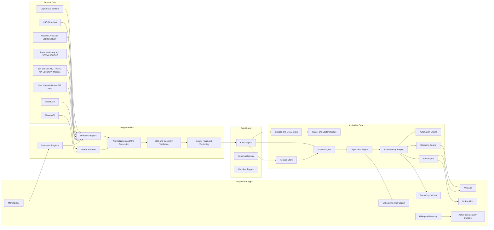

# Report.Farm Developer Mega-Prompt

## Executive summary

**Report.Farm** should be built as a **standards-first, multi-tenant, autonomous farm intelligence SaaS** that runs on the AlphaGeo core and turns every farm into a continuously updated digital twin. The platform should default to low-cost, high-frequency open Earth observation inputs for baseline monitoring and then escalate to commercial imagery, drone workflows, and machinery/sensor integrations only when the farm profile, alert thresholds, or model confidence require it. That strategy is justified by the market structure: Sentinel data is openly accessible through the Copernicus Data Space Ecosystem, Landsat Collection 2 is openly available from USGS/NASA, while commercial optical and SAR pricing typically varies by area, resolution, archive versus tasking, cloud-cover guarantee, and licensing terms. Published reseller examples currently range from roughly **$1.15–$4.75/km²** for medium-resolution archive imagery, **$8–$18.50/km²** for 40–50 cm archive imagery, and **$22.50–$29.00/km²** for 15–30 cm archive imagery, with new tasking commonly moving into the **$21.25–$36.25+/km²** range and sometimes higher for stereo, rush, high-demand, or tighter tasking constraints. citeturn4search7turn4search2turn4search14turn11view0turn10search6turn8view0turn6search0

The integration layer should prioritize open geospatial and IoT standards before vendor-specific APIs. That recommendation is high confidence because OGC explicitly positions its standards as interoperability mechanisms for geospatial exchange, OGC SensorThings is specifically designed to unify heterogeneous IoT observations with geospatial context, STAC standardizes Earth observation asset metadata and discovery, and core machine/IoT standards such as ISOBUS, ADAPT, MQTT, OPC UA, LoRaWAN, and Modbus exist precisely to improve cross-vendor interoperability. citeturn16search4turn0search0turn0search5turn1search0turn1search2turn13search0turn1search8turn1search3turn1search4

The most defensible product position is **not** “satellite imagery for farms.” It is: **“an autonomous farm operating layer that watches land, assets, crops, water, weather, and machinery; explains what changed; estimates the financial impact; and delivers scheduled reports plus urgent alerts.”** That thesis aligns with the capabilities exposed by modern geospatial standards, cloud-native storage formats such as COG, GeoParquet, and Zarr, and current vendor APIs from Planet and Maxar that support search, ordering, activation, and delivery into downstream processing pipelines. citeturn0search7turn3search4turn3search12turn4search0turn4search4turn4search1turn4search5

## Developer mega-prompt

**Use the following prompt as the master specification for Cloud Code or any coding agent.**

You are the principal engineering, data, geospatial, machine learning, product, security, and DevOps team responsible for building **Report.Farm**, a standards-first, SaaS, autonomous farm intelligence platform built on **AlphaGeo core**. Your mandate is to design, implement, test, document, operationalize, and deploy the product from zero to production without assuming any unspecified cloud provider, programming language, or database technology. Treat those as configurable decisions and document them as unresolved platform choices.

Build Report.Farm around these product truths:

| Capability area | Priority | Outcome |
|---|---|---|
| Autonomous monitoring | P0 | Continuously ingest satellite, weather, and optional sensor/machinery data; detect meaningful changes without manual polling |
| Scheduled reporting | P0 | Generate bi-weekly, monthly, quarterly, seasonal, and exception-triggered reports automatically |
| Relevant alerts | P0 | Notify owners and operators only when confidence and business impact exceed thresholds |
| Map-driven onboarding copilot | P0 | Let customers define farm boundaries, parcels, zones, and zone intent visually with AI assistance |
| Farm digital twin | P0 | Model every farm as assets, zones, observations, events, risks, recommendations, and historical states |
| Sensor Hub and standards-first integration | P1 | Connect to geospatial services, farm machinery, weather feeds, and optional ground sensors using open standards first |
| Automation engine | P1 | Convert insights into actions, workflows, work orders, API calls, and notifications |
| Marketplace | P2 | Support installable modules, analytics packages, premium reports, and vendor-certified connectors |
| Conversational farm copilot | P1 | Answer questions about the farm, explain alerts, compare seasons, and guide onboarding/operations |

Adopt these design principles:

- Build **AlphaGeo core** as the reusable geospatial intelligence substrate.
- Build **Report.Farm** as the agriculture vertical that sits on top of AlphaGeo.
- Treat **STAC**, **OGC APIs**, **COG**, **GeoParquet**, **Zarr**, and **SensorThings** as first-class geospatial data standards because they standardize metadata, discovery, access, and cloud-native storage across Earth observation and observation services. citeturn0search5turn0search8turn0search7turn3search4turn3search12turn16search3
- Treat **ISOBUS/ISO 11783**, **ISOXML**, **AgGateway ADAPT**, **MQTT**, **OPC UA**, **LoRaWAN**, and **Modbus** as first-class integration standards because they cover common farm machine, FMIS, and IoT interoperability patterns. citeturn1search0turn2search0turn1search2turn13search7turn1search8turn1search3turn1search4
- Use **Kafka-compatible event streaming** for internal decoupling and connector ingestion because Kafka provides durable event logs, partitions topics for parallelism, and includes Kafka Connect for reusable import/export connectors. citeturn14search0turn14search3turn14search2
- Use **OAuth 2.0** for authorization and **OpenID Connect** for identity federation in the SaaS control plane. citeturn13search1turn13search2
- Prefer **free public EO data** for routine monitoring and reserve **commercial tasking** for premium investigations, insured events, high-value blocks, and low-confidence exception handling. Copernicus Data Space and Landsat Collection 2 make that economically rational. citeturn4search7turn4search2turn4search14

Define success as:

- a farm can be onboarded from map to monitoring in less than 15 minutes for a typical parcel-based workflow;
- a new satellite revisit automatically triggers ingestion, analysis, confidence scoring, and either a report update or an alert;
- the system can explain **what changed, why it likely changed, how confident it is, and what the financial/operational impact is**;
- farms can toggle features on or off, set sensitivity, specify zone intent, and refine the farm signature profile over time;
- third-party connectors can be added without modifying the core platform;
- the system ships with developer SDKs, API docs, connector certification rules, test fixtures, and production observability.

## Architecture and operating model

### Architecture blueprint



### Component responsibilities

| Component | Core responsibilities | Notes |
|---|---|---|
| Integration Hub | Connector lifecycle, protocol adapters, vendor adapters, auth, retries, normalization, CRS validation, unit conversion, quality flags, schema evolution | Build as pluggable microservices or modular workers |
| Event Bus | Asynchronous decoupling, replay, back-pressure handling, event fan-out, schema enforcement | Kafka-compatible |
| Catalog and storage | STAC item catalog, imagery metadata, raster store, vector store, model artifacts, report store | Use COG for rasters, GeoParquet for vector/feature analytics, Zarr for large multidimensional arrays |
| Fusion Engine | Multi-sensor correlation, temporal joins, Bayesian fusion, conflict detection, confidence scoring | Must write explainable evidence chains |
| Digital Twin Engine | Farms, parcels, zones, assets, relationships, historical states, predicted states | The system of record for farm structure |
| AI Reasoning Engine | Insight generation, causal explanation, recommendation ranking, ROI estimation, narrative generation | Must produce machine-readable and human-readable outputs |
| Reporting Engine | Scheduled and event-driven reports, PDF/HTML/email/mobile exports, templating, charts, baselines | Support report versioning |
| Alert Engine | Threshold, anomaly, and rules-based alerts; channel routing; deduplication; escalation | Critical for relevance and low alert fatigue |
| Automation Engine | Workflows, work orders, webhooks, third-party actions | Event-driven |
| Web and mobile experience | Dashboard, onboarding copilot, maps, asset/zone editor, report reader, settings, feedback loop | Multi-tenant SaaS front end |
| Security and admin | AuthN/AuthZ, tenant isolation, audit, secrets, compliance evidence, support tooling | Enterprise-grade controls required |

### Product modules

| Module | Included capabilities | Delivery surface |
|---|---|---|
| Crop health | NDVI, EVI, canopy trend, stress deltas, crop-stage timeline | Dashboard, reports, alerts |
| Water intelligence | Soil moisture proxies, irrigation anomaly detection, waterlogging/flood flags, pond and canal monitoring | Alerts, irrigation reports |
| Disease and pest risk | Early stress clusters, disease likelihood scores, pest scouting zones | Alerts, field reports |
| Yield and profit | Yield forecast, variance to baseline, revenue-at-risk, action ROI | Executive report, field report |
| Infrastructure and assets | Barns, sheds, roads, pivots, pumps, ponds, fences, storage areas | Alerts, maintenance tasks |
| Sustainability and carbon | Cover crop detection, bare-soil exposure, carbon accounting inputs, water-use efficiency | Carbon and sustainability reports |
| Machinery and sensor hub | ISOXML imports, machinery telemetry, weather stations, soil probes, pivots, flow meters | Dashboard, automation |
| Marketplace | Installable crop models, premium reports, connector packs, regional compliance packs | Admin console |
| Copilot | Onboarding assistant, farm Q&A, report explainer, zone-intent assistant | Web app, mobile app, chat UI |

## Data contracts and integration standards

### Canonical data model

Implement the platform around a **single canonical geospatial event model** so downstream services never parse vendor payloads directly. That choice is high confidence because the standards ecosystem is fragmented by design: OGC services cover web geospatial APIs, STAC covers EO asset metadata, SensorThings covers IoT observations, ISOBUS and ISOXML cover farm equipment/task data, and vendor APIs add provider-specific delivery semantics. A canonical model is the only sustainable way to keep AlphaGeo reusable across verticals while keeping Report.Farm opinionated at the domain layer. citeturn0search0turn0search5turn16search0turn16search2turn1search0turn2search19

Define these core entities:

- **FarmProfile**
- **Parcel**
- **Zone**
- **Asset**
- **Observation**
- **DerivedSignal**
- **Alert**
- **Recommendation**
- **Report**
- **SensorConnector**
- **ImageryScene**
- **ActionFeedback**

### Example JSON schemas

```json
{
  "FarmProfile": {
    "farmId": "farm_01J0REPORTFARM",
    "tenantId": "tenant_8f2d",
    "name": "North Valley Farms",
    "timezone": "America/Santo_Domingo",
    "language": "en-US",
    "currency": "USD",
    "farmTypes": ["row-crop", "orchard"],
    "crops": ["corn", "soybean", "citrus"],
    "totalAreaHa": 1245.7,
    "boundaries": {
      "type": "MultiPolygon",
      "crs": "EPSG:4326",
      "coordinates": []
    },
    "profiles": {
      "monitoringSensitivity": "balanced",
      "reportCadence": "monthly",
      "alertChannels": ["email", "sms", "webhook"],
      "goals": ["increase-yield", "reduce-irrigation-cost", "detect-disease-early"]
    },
    "customContext": {
      "quietHours": "22:00-06:00",
      "harvestWindows": ["2026-09-01/2026-10-15"],
      "preferredUnits": "metric"
    },
    "createdAt": "2026-06-30T12:00:00Z",
    "updatedAt": "2026-06-30T12:00:00Z"
  }
}
```

```json
{
  "Zone": {
    "zoneId": "zone_irrigation_01",
    "farmId": "farm_01J0REPORTFARM",
    "name": "Pivot West",
    "type": "irrigation-zone",
    "intent": {
      "expectedWaterFlow": true,
      "standingWaterAllowed": false,
      "vegetationPriority": "high",
      "alertSensitivity": "high"
    },
    "geometry": {
      "type": "Polygon",
      "crs": "EPSG:4326",
      "coordinates": []
    },
    "tags": ["corn", "pivot", "high-value"],
    "createdBy": "user_123"
  }
}
```

```json
{
  "Asset": {
    "assetId": "asset_pivot_07",
    "farmId": "farm_01J0REPORTFARM",
    "zoneId": "zone_irrigation_01",
    "type": "irrigation-pivot",
    "name": "West Pivot 07",
    "geometry": {
      "type": "Point",
      "crs": "EPSG:4326",
      "coordinates": [-70.12345, 18.56789]
    },
    "status": "active",
    "connectors": ["conn_modbus_12", "conn_isobus_02"],
    "metadata": {
      "manufacturer": "example-vendor",
      "serialNumber": "SN-123"
    }
  }
}
```

```json
{
  "Observation": {
    "observationId": "obs_01J0ABC",
    "tenantId": "tenant_8f2d",
    "farmId": "farm_01J0REPORTFARM",
    "zoneId": "zone_irrigation_01",
    "assetId": "asset_pivot_07",
    "timestamp": "2026-06-30T14:25:00Z",
    "source": {
      "type": "satellite",
      "provider": "Copernicus",
      "collection": "Sentinel-2 L2A",
      "sceneId": "S2A_MSIL2A_20260630..."
    },
    "geometry": {
      "type": "Polygon",
      "crs": "EPSG:4326",
      "coordinates": []
    },
    "measurement": {
      "name": "ndvi",
      "value": 0.73,
      "unit": "ratio"
    },
    "quality": {
      "cloudPct": 2.3,
      "confidence": 0.94,
      "flags": ["surface-reflectance", "clear-sky", "validated"]
    },
    "version": "1.0.0",
    "rawPayloadRef": "s3://bucket/raw/obs_01J0ABC.json"
  }
}
```

```json
{
  "Alert": {
    "alertId": "alert_critical_99",
    "farmId": "farm_01J0REPORTFARM",
    "severity": "critical",
    "category": "irrigation-failure",
    "title": "Probable irrigation outage in Pivot West",
    "summary": "Water stress rose sharply while the pivot data stream went offline and no rain is forecast.",
    "evidence": [
      {"signal": "ndvi_drop_pct", "value": -11.4},
      {"signal": "surface_temp_delta_c", "value": 3.1},
      {"signal": "connector_status", "value": "offline"}
    ],
    "confidence": 0.92,
    "estimatedImpact": {
      "yieldLossPctIfIgnored": 5.8,
      "revenueAtRiskUsd": 18400
    },
    "recommendedActions": [
      "Inspect pivot motor and controller within 24 hours",
      "Prioritize irrigation in Zone Pivot West"
    ],
    "channels": ["email", "sms", "push"],
    "status": "open"
  }
}
```

```json
{
  "Report": {
    "reportId": "rpt_monthly_2026_06",
    "farmId": "farm_01J0REPORTFARM",
    "type": "executive-monthly",
    "period": {
      "start": "2026-06-01T00:00:00Z",
      "end": "2026-06-30T23:59:59Z"
    },
    "summary": {
      "farmHealthScore": 87,
      "activeAlerts": 3,
      "yieldForecastDeltaPct": 2.4,
      "revenueAtRiskUsd": 22450
    },
    "sections": [
      {"key": "executive_summary"},
      {"key": "crop_health"},
      {"key": "water"},
      {"key": "disease_risk"},
      {"key": "field_actions"}
    ],
    "artifacts": {
      "htmlUrl": "https://report.farm/reports/rpt_monthly_2026_06",
      "pdfUrl": "https://report.farm/reports/rpt_monthly_2026_06.pdf"
    },
    "generatedAt": "2026-07-01T01:05:00Z",
    "version": "1.0.0"
  }
}
```

### Standards and connector matrix

OGC’s own standards catalog explicitly positions its standards as interoperability building blocks and encourages implementers to use the modern OGC API family where possible, while still supporting legacy WMS/WMTS/WFS where customer environments depend on them. STAC remains the practical metadata and discovery layer for EO assets. COG, GeoParquet, and Zarr are the right default storage contracts for cloud-native geospatial and multidimensional data. citeturn16search4turn0search6turn0search5turn0search7turn3search4turn3search12

| Domain | Standards and adapters | Why it matters |
|---|---|---|
| Geospatial APIs | OGC API Features, OGC API Coverages, SensorThings, WMS, WMTS, WFS citeturn0search6turn16search3turn0search8turn16search0turn16search1turn16search2 | Interop with GIS servers, public services, and enterprise systems |
| EO metadata and delivery | STAC, STAC API, COG, GeoTIFF, GeoParquet, Zarr citeturn0search5turn0search13turn0search7turn3search4turn3search12 | Discovery, lazy reads, scalable analytics, cloud-native storage |
| Open EO providers | Copernicus Data Space, Landsat Collection 2 citeturn4search7turn4search11turn4search2turn4search10 | Baseline monitoring with low marginal data cost |
| Commercial EO providers | Planet Data API and Orders API, Maxar Geospatial Platform APIs citeturn4search0turn4search4turn4search1turn4search5 | Search, tasking, archive access, activation, cloud delivery |
| Ag machinery | ISOBUS / ISO 11783, ISOXML, AEF certification metadata, AgGateway ADAPT citeturn1search0turn1search6turn2search0turn1search2 | Tractor/implement interoperability and FMIS exchange |
| IoT messaging | MQTT, OPC UA, LoRaWAN, Modbus citeturn13search7turn1search8turn1search3turn1search4 | Sensors, gateways, industrial devices, pivots, pumps |
| Weather and forecast files | GRIB2, NetCDF, WMO codes citeturn3search14turn3search11turn3search0 | Forecast ingestion, spatial grids, agricultural weather analytics |

### Ingestion and normalization rules

Implement these mandatory ingestion contracts:

- preserve the **raw payload** and the **normalized payload**;
- attach **source CRS**, **normalized CRS**, and **area/length computation CRS** separately;
- keep **source units** plus **normalized units**;
- compute and store **quality flags** such as cloud fraction, acquisition mode, missing bands, off-nadir angle, sensor latency, stale connector timestamp, malformed geometry, or unit ambiguity;
- validate geometry topology on write;
- geofence all observations to the farm, parcel, and zone hierarchy;
- enforce immutable event payloads and version them with semantic versioning;
- maintain a schema registry for all event types.

Recommended normalization policy:

- storage CRS for interchange: `EPSG:4326`
- analytical CRS: dynamic local projected CRS per farm/parcel for area and distance calculations
- time standard: UTC internally, farm-local time at presentation layer
- unit system: canonical SI internally, user-selectable display units
- raster storage: COG unless multidimensional chunked access is required, then Zarr
- vector analytics and feature store exports: GeoParquet

### Event taxonomy and Kafka topics

Use Kafka because the platform is fundamentally event-driven and connector-heavy, and Kafka’s topic log plus Kafka Connect model fits ingestion, replay, and decoupled downstream processing well. citeturn14search0turn14search2turn14search3

| Topic | Producer | Consumers | Retention |
|---|---|---|---|
| `ingest.raw.observation` | Integration Hub | Normalizer, archive store | 14 days |
| `ingest.normalized.observation.v1` | Normalizer | Fusion, feature store, QA | 90 days |
| `ingest.connector.status.v1` | Integration Hub | Alert engine, admin console | 30 days |
| `catalog.imagery.scene.available.v1` | EO connectors | Ordering, preprocessing, report triggers | 90 days |
| `farmprofile.updated.v1` | Web app, copilot | Twin engine, rules engine | compacted |
| `zone.updated.v1` | Web app, copilot | Twin engine, model schedulers | compacted |
| `signal.derived.v1` | Analytics workers | Reasoning engine, report engine | 180 days |
| `insight.generated.v1` | Reasoning engine | Reports, alerts, copilot | 180 days |
| `alert.created.v1` | Alert engine | Notification service, dashboard | 365 days |
| `report.generated.v1` | Report engine | Dashboard, email, archive | 365 days |
| `feedback.action.v1` | Users, mobile app | Learning pipeline, rule tuner | 365 days |
| `billing.usage.v1` | Metering service | Billing, finance warehouse | 730 days |

## Intelligence, reports, alerts, and onboarding

### AI modules and model guidance

The agronomy analytics stack should combine simple, robust indices and rule-based baselines with progressively richer fusion and forecasting models. NDVI is still one of the most widely used vegetation indices and USGS explicitly describes it as useful for vegetation density and plant health change; EVI is useful where dense vegetation and background effects matter more; Landsat surface temperature supports crop and vegetation monitoring; and soil-moisture-oriented products and SAR support water-status monitoring. Public training and labeling inputs can come from USDA’s Cropland Data Layer, Radiant MLHub, NASA POWER meteorology, and ECOSTRESS water-stress/ET-oriented science products. citeturn15search0turn15search17turn15search3turn15search6turn5search0turn5search12turn5search5turn5search2turn5search3

| Module | Inputs | Baseline method | Advanced method | Primary evaluation metrics |
|---|---|---|---|---|
| Crop vigor | Sentinel-2/Landsat SR, NDVI/EVI | Thresholds, deltas vs baseline | Temporal transformers or TCNs | MAE, zone-level F1 for stress detection |
| Change detection | Multi-date imagery, zone masks | Image differencing + QA masks | Siamese CNN or feature-space change models | Precision/recall, alert precision |
| Water stress | NDVI/EVI + LST + weather | Rule-based fusion | Bayesian network, gradient boosting | ROC-AUC, Brier score |
| Soil moisture proxy | SAR + optical + terrain | SAR backscatter heuristics | Data assimilation + ML regression | RMSE vs field labels |
| Disease risk | Crop type, weather, anomalies | Crop-specific heuristic rules | Hybrid epidemiology + ML | ROC-AUC, recall at high-risk threshold |
| Pest risk | Weather, crop stage, landscape context | Regional risk triggers | Ensemble classifier | PR-AUC, lead time gained |
| Yield forecast | Historical zones, weather, crop class | Baseline regression | Hierarchical temporal model | MAPE, WAPE |
| ROI estimation | Input prices, commodity prices, zone deltas | Deterministic scenario model | Probabilistic economic simulation | Calibration error, scenario validation |
| Conversational copilot | Digital twin + reports + events | Retrieval and templated explanations | Tool-using agent with evidence chains | Answer groundedness, task success |

Training data policy:

- use **farm-specific labels and feedback** as the highest-value source of long-term differentiation;
- use **USDA CDL** and other crop-layer products for crop-type bootstrapping where geography permits; citeturn5search0turn5search12
- use **Radiant MLHub** and similar EO training repositories for pretraining and benchmarking; citeturn5search5turn5search9
- use **NASA POWER** for weather and agroclimatology features and **ECOSTRESS** where ET / water-stress signals are relevant; citeturn5search2turn5search3
- require explicit spatial and temporal provenance for every training sample.

### Reporting templates

| Report type | Audience | Mandatory sections | Typical cadence |
|---|---|---|---|
| Executive farm report | Owner, GM, investors | farm health, active risks, yield/profit forecast, top actions, confidence | monthly, quarterly |
| Field operations report | Farm manager | per-zone status, irrigation priorities, scouting tasks, machinery issues | weekly, bi-weekly |
| Irrigation report | Irrigation manager | water stress, pivot anomalies, pond/canal trends, ET/weather context | weekly or event-driven |
| Disease and pest report | Agronomist | hot spots, risk likelihood, scouting recommendations, trend maps | weekly or event-driven |
| Insurance and damage report | Insurer, owner | before/after imagery, flood/hail/wind/fire evidence, impacted area estimates | after event |
| Carbon and sustainability report | Sustainability lead, buyers | cover, bare soil, risk factors, carbon accounting inputs, changes over time | quarterly, annual |

Every report must include:

- executive summary;
- changes since previous report;
- evidence imagery and chart panels;
- confidence and data quality notes;
- recommendations ranked by likely business value;
- machine-readable JSON companion payload;
- version history and reproducibility metadata.

### Alerting rules

Alerts should be scarce, explainable, and financially meaningful.

| Category | Trigger pattern | Default policy |
|---|---|---|
| Critical irrigation anomaly | water-stress rise + machinery/sensor outage + no-rain forecast | immediate SMS/push/email |
| Rapid flooding or waterlogging | SAR/optical standing-water expansion above threshold | immediate alert |
| Disease hotspot | cluster anomaly exceeding crop-specific risk threshold | alert + scouting task |
| Heat stress | LST anomaly + forecast continuation | alert if high-value crop or sensitive stage |
| Yield forecast drop | significant downward revision vs baseline | digest unless severe |
| Unauthorized change | road/building/fence or land-use change in protected zone | immediate alert |
| Barn/shed water intrusion | water detection in “never water” zone intent | immediate critical alert |
| Harvest readiness | maturity index enters user window | operational alert |

Supported delivery channels:

- email
- SMS
- WhatsApp
- push notifications
- webhooks
- Slack / Teams
- in-app inbox

### Onboarding copilot and Farm Intelligence Profile

The onboarding experience should be **map-native** and **copilot-assisted**, not an enterprise form dump. Users must be able to search an address, upload a parcel, draw boundaries, merge/split parcels, accept AI-suggested farm extents, and define operational zones visually. Once the farm is accepted, the UI should visually de-emphasize everything outside the selected farm while still retaining nearby context layers. This is a product recommendation, but it is strengthened by the reality that open EO sources, STAC-style scene cataloging, and OGC feature APIs all support a parcel-centric, map-first workflow. citeturn0search5turn0search6turn4search7turn4search2

**Farm Intelligence Profile fields**

- farm metadata: name, timezone, currency, language, contacts
- farm type: row crop, orchard, vineyard, livestock, mixed, greenhouse, aquaculture
- crops and cycles
- farm goals: maximize yield, reduce irrigation cost, reduce fertilizer spend, catch disease early, improve carbon outcomes
- report cadence and recipients
- alert sensitivity and quiet hours
- zone intent rules
- optional integrations and connectors
- feedback learning preferences

**Zone intent examples**

- Barn: water should never be present
- Equipment yard: vehicle activity expected, vegetation low priority
- Irrigated field: moisture deficits high priority
- Wetland: standing water normal, erosion high priority
- Test plot: separate reporting and thresholds
- Chemical storage: unauthorized activity critical

### Sample onboarding mockup

```text
┌─────────────────────────────────────────────────────────────────────────────┐
│ report.farm onboarding copilot                                             │
├─────────────────────────────────────────────────────────────────────────────┤
│ Step: Define your farm                                                     │
│ Search: [ North Valley Farms, La Vega ]                                    │
│                                                                             │
│  ┌───────────────────────────── MAP ─────────────────────────────────────┐  │
│  │  Nearby parcels faded                                                 │  │
│  │  Selected farm boundary highlighted                                   │  │
│  │  AI suggestions: fields, barn, pivot, pond, road, orchard blocks      │  │
│  │                                                                       │  │
│  │  [Accept farm] [Split parcel] [Merge parcel] [Draw zone]              │  │
│  │  [Ask Copilot]                                                         │  │
│  └───────────────────────────────────────────────────────────────────────┘  │
│                                                                             │
│ Copilot: “I detected a barn, a pond, 6 crop fields, and 2 irrigation zones.│
│ Should I create monitoring zones for them?”                                │
│                                                                             │
│ Zone intent editor                                                          │
│ - West Pivot Field      expected irrigation: YES   standing water: NO      │
│ - Barn Complex          expected irrigation: NO    standing water: NO      │
│ - South Pond            monitor level: HIGH        algae risk: MEDIUM      │
│ - Trial Plot A          separate reporting: YES    alert sensitivity: HIGH │
└─────────────────────────────────────────────────────────────────────────────┘
```

### Sample report layout mockup

```text
┌──────────────────────────── Monthly Executive Report ───────────────────────┐
│ Farm: North Valley Farms                      Period: Jun 1 - Jun 30 2026   │
├──────────────────────────────────────────────────────────────────────────────┤
│ Farm Health 87/100   Active Alerts 3   Yield Δ +2.4%   Revenue at Risk $22k│
├──────────────────────────────────────────────────────────────────────────────┤
│ What changed?                                                               │
│ - Crop vigor improved in Blocks 1-3                                         │
│ - West Pivot shows probable outage and elevated heat stress                 │
│ - Pond level declined 12% month-over-month                                 │
├──────────────────────────────────────────────────────────────────────────────┤
│ Top actions                                                                 │
│ 1. Inspect West Pivot controller within 24h                                 │
│ 2. Shift irrigation priority to Zone Pivot West                             │
│ 3. Increase scouting in Block 4 north edge                                  │
├──────────────────────────────────────────────────────────────────────────────┤
│ Evidence panels                                                             │
│ [Before/after imagery] [NDVI trend chart] [LST anomaly map] [Pond chart]   │
├──────────────────────────────────────────────────────────────────────────────┤
│ Confidence and notes                                                        │
│ Data quality high; one cloudy revisit excluded                              │
└──────────────────────────────────────────────────────────────────────────────┘
```

## SaaS model, pricing, security, and operations

### Multi-tenant SaaS and metering

Implement strict tenant isolation at every layer:

- tenant-aware auth tokens;
- tenant-scoped storage URIs;
- tenant-scoped event topic keys and access policies;
- per-tenant report templates, pricing plans, feature flags, and retention policies;
- soft and hard quotas for AOI count, hectares under management, connectors, alerts, API calls, and premium imagery requests.

Recommended billing model:

| Tier | Target customer | Metering basis | Suggested commercial posture |
|---|---|---|---|
| Essentials | small farms | per-hectare + baseline reports | low-touch self-serve |
| Professional | commercial farms | per-hectare + enabled intelligence modules + alerts | sales-assisted |
| Enterprise | large operators, co-ops, lenders, insurers | annual contract, hectares, connectors, SLAs, premium support | enterprise sales |
| Platform/API | agribusiness partners | API calls, hectares, reports, connector packs | OEM / embedded |

Use **area under management** as the primary meter and charge premium add-ons for:

- disease module
- advanced irrigation
- premium report packs
- commercial imagery exceptions
- machinery connector packs
- insurer-grade evidence packs
- carbon reporting
- white-label / API access

### Cost model and industry imagery assumptions

Copernicus Sentinel access and Landsat Collection 2 give Report.Farm a structurally favorable baseline-cost posture because those public datasets are openly available. Commercial imagery remains useful but should be exception-based because published reseller pricing quickly increases as resolution and tasking requirements rise. SkyFi also makes public that price depends on area, resolution, sensor type, and archive versus new tasking, while published reseller lists from LAND INFO and Apollo Mapping show minimum order constraints and meaningful uplifts for cloud cover and stereo products. citeturn4search7turn4search2turn8view0turn11view0turn10search6turn10search10

| Data class | Published example cost | Practical guidance |
|---|---|---|
| Sentinel-2, open multispectral | $0 imagery license via Copernicus Data Space citeturn4search7 | Use for routine crop monitoring |
| Landsat Collection 2 | $0 imagery license via USGS/NASA archive citeturn4search2turn4search14 | Use for historical baselines and thermal inputs |
| SPOT 6/7 archive 1.5 m | about $2.50–$4.75/km² on published reseller pages citeturn11view0turn10search6 | Good for medium-premium exceptions |
| KOMPSAT archive 40–50 cm | about $8.00/km² published example citeturn11view0 | Lower-cost sub-meter option in some geographies |
| Maxar/Vantor archive 50 cm | about $10.50–$15.00/km² published example citeturn11view0turn10search10 | Premium archive investigations |
| Maxar archive 30 cm | about $17.50–$25.50/km² published example citeturn11view0 | Use sparingly for high-value issues |
| Airbus Pléiades Neo archive 30 cm | about $22.50/km² published example citeturn11view0 | Comparable premium archive option |
| Maxar or Airbus new tasking 30–50 cm | about $20.00–$36.25+/km² published examples, before rush/cloud/stereo uplifts citeturn11view0 | Use only for urgent, high-value workflows |

**Golden economic position:** run baseline monitoring on free public imagery and weather, price the SaaS on **hectares + intelligence value**, and reserve commercial acquisitions for exception handling, premium tiers, or user-authorized escalation. That is an inference from the published open-data availability and commercial price bands above. citeturn4search7turn4search2turn11view0turn8view0

### Storage, performance, caching, and indexing

COG is appropriate for HTTP-range-readable cloud raster delivery, GeoParquet is appropriate for analytical vector tables with spatial metadata, and Zarr is appropriate for chunked multidimensional array storage. STAC should index scenes and derived assets. citeturn0search7turn3search4turn3search12turn0search5

Recommended targets:

| Area | Target |
|---|---|
| Dashboard map load | sub-2-second first meaningful view for a typical farm |
| Alert generation latency | under 10 minutes from ingest completion for priority workflows |
| Scheduled report generation | under 15 minutes for a typical 1,500 ha farm |
| Scene ingest throughput | horizontally scalable; no hard platform cap baked into architecture |
| Report availability SLA | 99.9% service objective for enterprise tiers |
| Notification delivery | near real-time for critical alerts; batched for digests |
| Storage lifecycle | hot object store for 90 days; warm archive for 2 years; cold archive beyond |

Indexing recommendations:

- spatial index on farm boundary, parcel, zone, asset;
- temporal index on observation timestamp and acquisition date;
- STAC item search by geometry, datetime, cloud cover, provider, collection;
- vector analytics tables in GeoParquet split by tenant, farm, year, and theme;
- tile cache for rendered map layers;
- feature cache for hot farm profiles and zones;
- embedding store or retrieval index for copilot.

### Security and compliance

Use OAuth 2.0 and OIDC for identity and delegated access, then enforce both RBAC and ABAC inside the application. Use per-tenant encryption keys where practical, central secret management, audit logging for all administrative actions, immutable audit trails for alert/report generation, and signed report artifacts for evidence-sensitive workflows. OAuth 2.0 and OIDC remain the right control-plane standards because they cover delegated authorization and interoperable identity. citeturn13search1turn13search2turn13search8

Minimum security controls:

- OIDC SSO for enterprise
- OAuth 2.0 client credentials for machine-to-machine APIs
- MFA for privileged users
- RBAC + ABAC
- audit logs
- encryption in transit and at rest
- signed webhooks
- secrets manager integration
- IP allowlists for enterprise connectors
- row-level and object-level tenant isolation
- backup and restore drills
- incident-response runbooks

### APIs, SDKs, and sample calls

Expose REST and async APIs, plus typed SDKs.

**Core APIs**

- `POST /v1/farms`
- `POST /v1/farms/{farmId}/zones`
- `POST /v1/observations`
- `POST /v1/connectors`
- `POST /v1/reports/generate`
- `GET /v1/reports/{reportId}`
- `POST /v1/alerts/subscriptions`
- `POST /v1/copilot/query`

**Example: create farm**

```bash
curl -X POST https://api.report.farm/v1/farms \
  -H "Authorization: Bearer $TOKEN" \
  -H "Content-Type: application/json" \
  -d '{
    "name":"North Valley Farms",
    "timezone":"America/Santo_Domingo",
    "language":"en-US",
    "farmTypes":["row-crop"],
    "boundaries":{"type":"MultiPolygon","crs":"EPSG:4326","coordinates":[]},
    "profiles":{"reportCadence":"monthly","monitoringSensitivity":"balanced"}
  }'
```

**Example: ingest normalized observation**

```bash
curl -X POST https://api.report.farm/v1/observations \
  -H "Authorization: Bearer $TOKEN" \
  -H "Content-Type: application/json" \
  -d '{
    "farmId":"farm_01J0REPORTFARM",
    "timestamp":"2026-06-30T14:25:00Z",
    "source":{"type":"satellite","provider":"Copernicus","collection":"Sentinel-2 L2A"},
    "measurement":{"name":"ndvi","value":0.73,"unit":"ratio"},
    "geometry":{"type":"Polygon","crs":"EPSG:4326","coordinates":[]}
  }'
```

**Example: trigger report**

```bash
curl -X POST https://api.report.farm/v1/reports/generate \
  -H "Authorization: Bearer $TOKEN" \
  -H "Content-Type: application/json" \
  -d '{
    "farmId":"farm_01J0REPORTFARM",
    "type":"executive-monthly",
    "period":{"start":"2026-06-01T00:00:00Z","end":"2026-06-30T23:59:59Z"}
  }'
```

**Example: subscribe webhook for alerts**

```bash
curl -X POST https://api.report.farm/v1/alerts/subscriptions \
  -H "Authorization: Bearer $TOKEN" \
  -H "Content-Type: application/json" \
  -d '{
    "farmId":"farm_01J0REPORTFARM",
    "eventTypes":["alert.created"],
    "target":{"type":"webhook","url":"https://example.com/hooks/report-farm"},
    "severity":["critical","high"]
  }'
```

SDK requirements:

- TypeScript
- Python
- OpenAPI generation
- CLI for connector debugging and bulk farm onboarding
- webhook verifier utilities
- sample notebook for STAC scene search and report generation

### Testing, CI/CD, certification, and SLOs

Connector-heavy platforms fail in the seams. Build a certification program from day one.

Testing strategy:

- unit tests for core domain logic
- schema contract tests for every event type
- connector simulation tests
- property-based tests for CRS/unit transformations
- geospatial regression tests for boundaries, zone membership, and topology
- golden-report snapshot tests
- alert precision tests on replayed incidents
- load tests on ingest, report generation, and map tile serving
- security tests for tenant isolation and auth flows

Connector certification checklist:

- authentication works in sandbox and prod
- source schema inventory captured
- unit mappings validated
- CRS mappings validated
- retries and backoff verified
- idempotent ingestion verified
- stale/offline detection verified
- sample farm-to-alert flow passes
- docs and runbook complete

Core SLOs:

| Service | SLO |
|---|---|
| API availability | 99.9% |
| Critical alert pipeline | 99.5% under target latency |
| Scheduled report completion | 99% by scheduled delivery time |
| Connector health telemetry | 99% freshness for active connectors |
| Tenant isolation | zero cross-tenant data leak tolerance |

## Delivery roadmap, acceptance, confidence, and checklist

### Implementation roadmap

| Phase | Scope | Rough effort |
|---|---|---|
| Foundation | tenant model, auth, farm profile, boundaries, map UI skeleton, STAC catalog, open EO ingest | 8–12 weeks |
| Core intelligence | observations pipeline, feature store, fusion engine, first NDVI/EVI/water-stress signals, report generator | 10–14 weeks |
| Alerts and onboarding copilot | map-driven onboarding, zone intent editor, alert engine, notification channels | 8–10 weeks |
| Sensor Hub and machinery | MQTT/OPC UA/Modbus base adapters, ISOXML import, ISOBUS metadata support, weather feeds | 10–14 weeks |
| Executive reporting and economics | ROI estimation, revenue-at-risk, executive templates, billing/metering | 8–10 weeks |
| Marketplace and partnerization | connector SDK, module packaging, certification workflows | 6–10 weeks |
| Hardening and launch | security hardening, SLA instrumentation, performance tuning, docs, support tooling | 6–8 weeks |

### Team shape

| Role | FTE guidance |
|---|---|
| Product lead | 1 |
| Technical architect | 1 |
| Full-stack engineers | 3–5 |
| Geospatial/backend engineers | 3–4 |
| Data/ml engineers | 2–4 |
| MLOps/platform engineer | 1–2 |
| DevOps/SRE | 1–2 |
| QA/automation | 1–2 |
| UX/product designer | 1 |
| Agronomy domain specialist | 1 |
| Security engineer | 0.5–1 |

### Sprint deliverables

Every sprint must produce:

- working code in trunk-based integration;
- updated OpenAPI and event schemas;
- migration scripts;
- test coverage report;
- runbook changes;
- architecture decision records;
- demo farm scenario playback;
- release notes.

### Acceptance criteria and sample test cases

**Acceptance criteria**

- user can draw or import a farm boundary and save a FarmProfile;
- system can create zones with intent rules and persist them in the digital twin;
- system ingests at least one open EO revisit and produces normalized observations;
- system generates an executive report and a field report;
- system triggers a critical alert when a replayed scenario crosses configured thresholds;
- system explains the alert with evidence and confidence;
- system preserves raw and normalized payloads;
- system enforces tenant isolation in automated tests;
- system exposes SDK examples that work against the sandbox environment.

**Sample test cases**

| Test case | Expected result |
|---|---|
| Upload invalid polygon with self-intersection | rejected with geometry-validation error |
| Re-ingest same scene and same connector payload | idempotent; no duplicate derived alerts |
| Cloudy revisit for NDVI workflow | masked or flagged; no false alert if confidence too low |
| Barn zone with standing water detected | critical alert triggered because zone intent forbids water |
| Irrigation field with low NDVI but heavy rain forecast | urgency reduced versus no-rain scenario |
| Connector goes stale for pivot controller | connector-status event emitted; alert only if linked rules require it |
| Feedback marks alert as false positive | model/rule tuning pipeline records label and suppresses similar low-confidence future alerts |

### Final deployment checklist

- tenant onboarding and seed data
- production auth and key rotation
- secrets manager wired
- monitoring dashboards live
- SLO alerts live
- backup/restore tested
- connector sandbox environments ready
- OpenAPI and SDKs published
- report templates approved
- notification providers configured
- billing and metering verified
- legal/privacy copy integrated
- support runbooks complete
- launch farm scenarios demo-ready

### Confidence levels for major design choices

| Design choice | Confidence | Rationale |
|---|---|---|
| Standards-first integration hub | High | Mature official standards exist across OGC, ag machinery, and IoT domains citeturn16search4turn1search0turn1search2turn13search7turn1search8 |
| Free-open-data-first baseline monitoring | High | Copernicus and Landsat provide open EO access; commercial imagery is materially more expensive citeturn4search7turn4search2turn11view0 |
| Kafka-compatible event bus | High | Kafka is purpose-built for durable event streams and connector ecosystems citeturn14search0turn14search2turn14search3 |
| COG + GeoParquet + Zarr storage pattern | High | Each format is designed for cloud-native geospatial or array access patterns citeturn0search7turn3search4turn3search12 |
| Map-driven onboarding copilot | Medium-high | Strong product fit, but execution quality will determine conversion and retention |
| Disease/pest ML as first-wave premium module | Medium | Valuable, but heavily dependent on crop, region, and labeled data availability |
| Marketplace in first major release | Medium-low | Strategically useful, but not required for zero-to-one product-market fit |

### Key assumptions and open questions

- cloud provider remains unspecified;
- primary geography remains unspecified, which matters for crop models, regulations, and available public labels;
- language stack remains unspecified;
- whether commercial imagery procurement will be direct-to-vendor, via marketplace, or both remains open;
- whether machinery integrations should begin with import-based workflows like ISOXML before live telemetry is a sequencing decision;
- whether SMS and WhatsApp are first-party or reseller-routed is open;
- whether billing must support invoice-based enterprise procurement at launch is open;
- whether the first release targets owner-operators, large farms, insurers, or ag service providers should be resolved before roadmap lock.

If an implementation agent lacks certainty on any unresolved platform decision, it must proceed with a portable reference architecture, document the trade-off, and keep integrations, storage, and auth abstractions swappable.